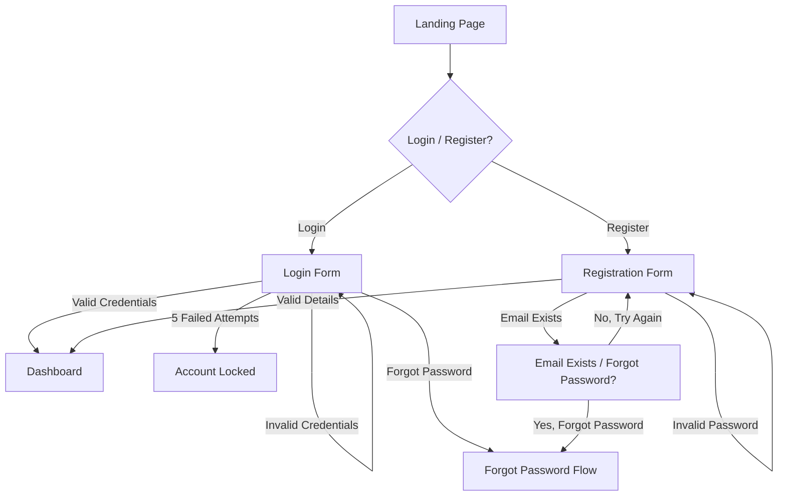
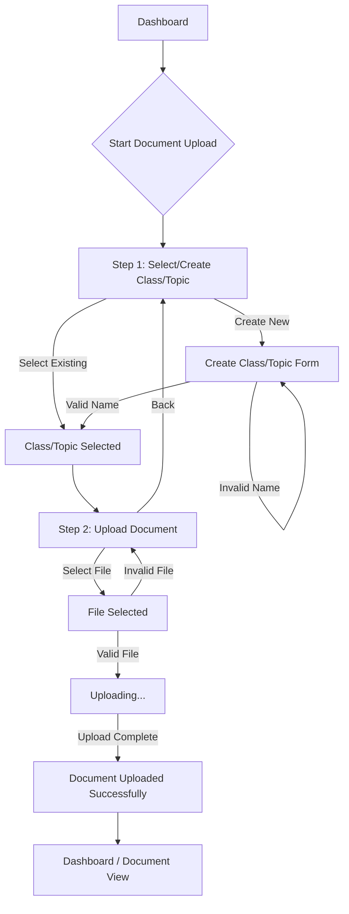

# ibe160 UX Design Specification

_Created on 2025-11-16 by BIP_
_Generated using BMad Method - Create UX Design Workflow v1.0_

---

## Executive Summary

The AI Study Buddy, a web app to help students overcome information overload by transforming dense study materials into concise summaries and interactive quizzes. The core goal is to shift users from feeling overwhelmed to feeling confident, making them feel empowered and in control, efficient and productive, focused, connected and engaged.

---

## 1. Design System Foundation

### 1.1 Design System Choice

We will be using **shadcn/ui** as our design system. This choice aligns perfectly with the project's use of React and Tailwind CSS, offering high customizability and full ownership of component code. This flexibility will allow us to craft a unique and tailored user experience that supports the project's vision and desired emotional responses. shadcn/ui provides a comprehensive set of accessible UI components, including Accordion, Alert Dialog, Button, Calendar, Card, Data Table, Dialog, Dropdown Menu, Form, Input, Select, Table, Tabs, and more.

### 1.2 Versioning Strategy

Unlike traditional component libraries that are versioned in `package.json`, shadcn/ui components are added directly to the project's codebase. The recommended approach is to always use the latest available components by fetching them via the `npx shadcn@latest add [component]` CLI command. This ensures access to the most up-to-date code and features. As of November 2025, the CLI is considered stable. This strategy provides maximum flexibility and full ownership over the component implementation, eliminating dependency management issues for the UI components themselves.

---

## 2. Core User Experience

### 2.1 Defining Experience

The core experience revolves around users taking quizzes and reading summaries. Uploading files should be absolutely effortless. It is critical to get the generation of good summaries and quizzes right. The platform will be web-based. The defining experience is like having a personal learning-assistant.

### 2.2 Core Experience Principles

*   **Speed:** Key actions like generating summaries and quizzes should feel fast (under 30 seconds as per PRD), and UI interactions should be instantaneous.
*   **Guidance:** The experience should be supportive and provide clear, step-by-step guidance, especially for the target user "The Overwhelmed Student".
*   **Flexibility:** The user should have control over key aspects like quiz length, but the interface should remain simple and not overwhelming.
*   **Feedback:** Feedback should be motivational and celebratory to foster a sense of confidence and progress.

### 2.3 Novel UX Patterns

None identified at this stage, focusing on robust implementation of core, established patterns.

---

## 3. Visual Foundation

### 3.1 Color System

The chosen color theme is **"Calm & Focused (Revised)"**, which incorporates light blues (`#A7D9E8`), greens (`#C8E6C9`), pinks (`#F8BBD0`), and purples (`#E1BEE7`) to create a supportive, calm, and focused learning environment. Semantic colors for success (`#A5D6A7`), warning (`#FFCC80`), error (`#EF9A9A`), and info (`#90CAF9`) will be used, along with a neutral grayscale palette.

### 3.2 Typography

*   **Font Families:** Clean, modern sans-serif fonts (e.g., Inter, Roboto, or system fonts) for headings and body text, and a readable monospace font for technical elements.
*   **Type Scale:** A standard hierarchical scale (h1-h6, body, small, tiny) with clear visual distinction.
*   **Font Weights:** Regular, Medium, Semibold for emphasis.
*   **Line Heights:** Optimized for readability (e.g., 1.5 for body text).

### 3.3 Spacing and Layout

*   **Base Unit:** 4px, consistent with Tailwind CSS.
*   **Spacing Scale:** Tailwind's default spacing scale (e.g., `p-1` for 4px, `p-2` for 8px).
*   **Layout Grid:** A flexible 12-column grid system.
*   **Container Widths:** Responsive container widths for different breakpoints.

**Interactive Visualizations:**

- Color Theme Explorer: [ux-color-themes.html](./ux-color-themes.html)

---

## 4. Design Direction

### 4.1 Chosen Design Approach

The chosen design approach is a combination of "Minimalist & Focused" and "Guided Workflow & Progressive," which we can call **"Guided Minimalism"** or **"Focused Workflow."**

This approach will feature:
*   **Layout:** Primarily single-column for content, with clear, spacious steps for workflows.
*   **Visual Hierarchy:** Subtle headers, strong emphasis on the current step and content within that step.
*   **Interaction:** Guided, wizard-like flows for complex tasks (upload, generate), with direct and clear calls to action. Minimal distractions.
*   **Visual Weight:** Light, abundant white space to maintain focus and reduce overwhelm.
*   **Content Approach:** Focused on one task at a time within workflows, with highly scannable information.
*   **Personality:** Professional, Efficient, Supportive, and Easy.
*   **Best for:** Users who need clear guidance for tasks but also appreciate a clean, uncluttered interface that helps them stay focused, aligning with the goal of reducing cognitive load and fostering confidence.

**Interactive Mockups:**

- Design Direction Showcase: [ux-design-directions.html](./ux-design-directions.html)

---

## 5. User Journey Flows

### 5.1 Critical User Paths

#### User Journey: User Registration and Authentication

*   **User Goal:** Securely create an account, log in, and manage their profile.
*   **Approach:** Hybrid (Primary screen offers both "Login" and "Register" options. Clicking "Register" expands fields or transitions to a focused registration form, while "Login" remains concise.)

**Flow Steps:**

1.  **Landing Page / Entry:**
    *   User sees: Clear "Login" and "Register" calls to action.
    *   User does: Clicks "Login" or "Register".
    *   System responds: Displays login form or registration form.

2.  **Login Form:**
    *   User sees: Fields for Email and Password, "Forgot Password" link.
    *   User does: Enters credentials, clicks "Login".
    *   System responds:
        *   If successful: Redirects to Dashboard.
        *   If incorrect credentials: Displays error message.
        *   If 5 failed attempts: Account locked message.

3.  **Registration Form:**
    *   User sees: Fields for Email, Password, Confirm Password. Password strength requirements displayed (min 5 letters, 1 number, 1 special symbol).
    *   User does: Enters details, clicks "Register".
    *   System responds:
        *   If successful: Account created, user logged in or redirected to login.
        *   If email exists: "Email already in use, Forgot Password?" message.
        *   If password invalid: Real-time validation feedback.

**Decision Points:**
*   Email already exists during registration: Offer "Forgot Password".
*   Failed login attempts: Account lock after 5 attempts.

**Error States:**
*   Invalid email format.
*   Password not meeting requirements.
*   Passwords not matching.
*   Incorrect login credentials.
*   Account locked.

**Success State:**
*   User successfully logged in and redirected to the main application dashboard.



#### User Journey: Document Upload

*   **User Goal:** Upload study materials (text/PDF) to the application, organized within a class/topic.
*   **Approach:** Wizard/Stepper (Guided, multi-step process).

**Flow Steps:**

1.  **Step 1: Select or Create Class/Topic**
    *   User sees:
        *   A clear heading: "Step 1: Organize Your Document"
        *   A list of existing classes/topics with a "Select" button for each.
        *   A prominent "Create New Class/Topic" button.
        *   A "Next" button (disabled until a selection is made or new class created).
    *   User does:
        *   Selects an existing class/topic.
        *   OR Clicks "Create New Class/Topic".
    *   **Sub-flow: Create New Class/Topic**
        *   User sees: A modal or inline form with a field for "Class/Topic Name" and "Create" / "Cancel" buttons.
        *   User does: Enters a name, clicks "Create".
        *   System responds:
            *   If successful: New class/topic added to the list, automatically selected.
            *   If name invalid/duplicate: Error message.
    *   User does: Clicks "Next".

2.  **Step 2: Upload Document**
    *   User sees:
        *   A clear heading: "Step 2: Upload Your File"
        *   The selected class/topic name displayed.
        *   A drag-and-drop area or "Browse Files" button.
        *   Information about supported file types (.txt, .pdf) and max file size (10MB).
        *   A "Back" button to return to Step 1.
        *   A "Upload" button (disabled until a file is selected).
    *   User does: Selects a file.
    *   System responds:
        *   Visual indication of file upload progress (e.g., progress bar).
        *   If file type unsupported: Error message: "This file type is not supported. Please try another file."
        *   If file too large: Error message: "File size exceeds 10MB limit."
        *   If PDF password-protected/corrupted: Error message: "This file is password-protected or corrupted and cannot be processed."
    *   User does: Clicks "Upload".

**Success State:**
*   Confirmation message: "Document uploaded successfully to [Class/Topic Name]!"
*   User is redirected to the dashboard or the newly uploaded document's view.



#### User Journey: Quiz Generation

*   **User Goal:** Generate a customized quiz from one or more documents.
*   **Approach:** Wizard/Stepper (A guided, multi-step process to configure and generate the quiz).

**Flow Steps:**

1.  **Entry Point (Context-Aware)**
    *   **Scenario A (From Document View):**
        *   User sees: A "Generate Quiz" button on the document page.
        *   User does: Clicks "Generate Quiz".
        *   System responds: Opens the Quiz Generation wizard, pre-selecting the current document.
    *   **Scenario B (From Dashboard/Elsewhere):**
        *   User sees: A "Generate Quiz" button.
        *   User does: Clicks "Generate Quiz".
        *   System responds: Opens the Quiz Generation wizard at Step 1.

2.  **Step 1: Select Document(s) (Conditional)**
    *   *This step is skipped if the user started from a document view.*
    *   User sees: A list of their uploaded documents, grouped by class/topic, with checkboxes.
    *   User does: Selects one or more documents.
    *   System responds: Enables the "Next" button.

3.  **Step 2: Configure Quiz Options**
    *   User sees:
        *   A clear heading: "Customize Your Quiz".
        *   **Quiz Length Options:** "Short (5 questions)", "Medium (10 questions)", "Long (15+ questions)".
        *   **Question Type Options:** "Multiple Choice", "True/False", "Combination".
        *   A **Summary Box** that updates in real-time (e.g., "You are creating a **Medium** quiz with **Combination** questions from **[Document Name]**.").
        *   "Back" and "Generate Quiz" buttons.
    *   User does: Selects their desired options.
    *   System responds: Updates the summary box.

4.  **Step 3: Generation in Progress**
    *   *This happens after the user clicks "Generate Quiz".*
    *   User sees: A loading screen or modal with a message like: "Generating your quiz... This may take up to 30 seconds." and a progress indicator.
    *   System responds: Processes the document(s) and generates the quiz questions in the background.
    *   **Error State:** If generation fails (e.g., document is unreadable, server error), a message appears: "Sorry, we couldn't generate your quiz. Please try again."

5.  **Step 4: Success & Start**
    *   User sees: A confirmation pop-up: "Your quiz is ready!" with a prominent "Start Quiz" button and maybe a "Save for Later" option.
    *   User does: Clicks "Start Quiz".
    *   System responds: Navigates the user to the first question of the quiz.

**Success State:**
*   The user is seamlessly transitioned into the quiz-taking experience.

```mermaid
graph TD
    subgraph Entry Point
        A[Document View] -->|Click "Generate Quiz"| C;
        B[Dashboard] -->|Click "Generate Quiz"| D[Step 1: Select Document(s)];
    end

    subgraph Quiz Wizard
        D --> C[Step 2: Configure Quiz];
        C --> E{Click "Generate Quiz"};
        E --> F[Step 3: Generation in Progress...];
        F -- Success --> G[Step 4: Success Modal];
        F -- Failure --> H[Error Message];
    end

    subgraph Taking the Quiz
        G -- Click "Start Quiz" --> I[Quiz Interface];
    end

    H --> C;
```

#### User Journey: Summary Generation

*   **User Goal:** Generate a concise summary from one or more documents in a preferred format.
*   **Approach:** Wizard/Stepper (A guided, multi-step process to configure and generate the summary).

**Flow Steps:**

1.  **Entry Point (Context-Aware)**
    *   **Scenario A (From Document View):**
        *   User sees: A "Generate Summary" button on the document page, next to or near the "Generate Quiz" button.
        *   User does: Clicks "Generate Summary".
        *   System responds: Opens the Summary Generation wizard, pre-selecting the current document.
    *   **Scenario B (From Dashboard/Elsewhere):**
        *   User sees: A "Generate Summary" button.
        *   User does: Clicks "Generate Summary".
        *   System responds: Opens the Summary Generation wizard at Step 1.

2.  **Step 1: Select Document(s) (Conditional)**
    *   *This step is skipped if the user started from a document view.*
    *   User sees: A list of their uploaded documents, grouped by class/topic, with checkboxes.
    *   User does: Selects one or more documents.
    *   System responds: Enables the "Next" button.

3.  **Step 2: Configure Summary Options**
    *   User sees:
        *   A clear heading: "Customize Your Summary".
        *   **Summary Format Options:** "Paragraph Summary", "Bullet Point Summary".
        *   A **Summary Box** that updates in real-time (e.g., "You are creating a **Bullet Point Summary** from **[Document Name]**.").
        *   "Back" and "Generate Summary" buttons.
    *   User does: Selects their desired format.
    *   System responds: Updates the summary box.

4.  **Step 3: Generation in Progress**
    *   *This happens after the user clicks "Generate Summary".*
    *   User sees: A loading screen or modal with a message like: "Generating your summary... This may take up to 30 seconds." and a progress indicator.
    *   System responds: Processes the document(s) and generates the summary in the background.
    *   **Error State:** If generation fails (e.g., document is unreadable, server error), a message appears: "Sorry, we couldn't generate your summary. Please try again."

5.  **Step 4: Success & View**
    *   User sees: A confirmation pop-up: "Your summary is ready!" with a prominent "View Summary" button and maybe a "Save for Later" option.
    *   User does: Clicks "View Summary".
    *   System responds: Navigates the user to the generated summary view.

**Success State:**
*   The user is seamlessly transitioned to view their generated summary.

```mermaid
graph TD
    subgraph Entry Point
        A[Document View] -->|Click "Generate Summary"| C;
        B[Dashboard] -->|Click "Generate Summary"| D[Step 1: Select Document(s)];
    end

    subgraph Summary Wizard
        D --> C[Step 2: Configure Summary];
        C --> E{Click "Generate Summary"};
        E --> F[Step 3: Generation in Progress...];
        F -- Success --> G[Step 4: Success Modal];
        F -- Failure --> H[Error Message];
    end

    subgraph Viewing the Summary
        G -- Click "View Summary" --> I[Summary View];
    end

    H --> C;
```

---

## 6. Component Library

### 6.1 Component Strategy

### 6.1 Component Strategy

Our strategy is to leverage **shadcn/ui** for as many standard components as possible, customizing them to fit our "Calm & Focused" color theme and "Guided Minimalism" design direction. We will identify and design custom components only when shadcn/ui does not offer a suitable primitive or when a unique interaction is required.

**Required Components Identified from User Journeys:**

*   **Input Fields:** Email, Password, Text (for class/topic names).
*   **Buttons:** Primary actions (e.g., "Generate Quiz", "Upload"), Secondary actions (e.g., "Back", "Cancel"), Destructive actions (if any).
*   **Links:** "Forgot Password".
*   **Modals/Dialogs:** For confirmations, errors, or multi-step forms (like "Create New Class/Topic").
*   **Lists/Tables:** To display existing classes/topics and documents.
*   **Checkboxes:** For selecting multiple documents.
*   **Radio Buttons/Segmented Controls:** For quiz length and question type, summary format.
*   **Progress Indicators:** For file uploads and content generation (loading screens, progress bars).
*   **Alerts/Toasts:** For success, error, warning, and info messages.
*   **Cards:** To display individual documents or quiz/summary options.
*   **Forms:** To group input fields and controls.
*   **Navigation:** Potentially tabs or a sidebar for main application navigation.
*   **Empty States:** For when no documents or quizzes exist.

**Components Provided by shadcn/ui:**

Many of the identified components are directly available or can be easily built using shadcn/ui primitives:

*   **Input:** For all text and password fields.
*   **Button:** For all action buttons.
*   **Dialog / AlertDialog:** Perfect for modals, confirmations, and error messages.
*   **Table:** Can be used for displaying lists of documents or classes.
*   **Checkbox:** For document selection.
*   **RadioGroup:** For quiz length, question type, and summary format.
*   **Progress:** For upload and generation progress.
*   **Toast / Alert:** For various feedback messages.
*   **Card:** Excellent for displaying documents, quizzes, or summaries in a visually distinct manner.
*   **Form:** To manage form states and validation.
*   **Tabs:** If we opt for tab-based navigation.

**Custom Components Needed / Components Requiring Heavy Customization:**

### 6.1 Component Strategy

Our strategy is to leverage **shadcn/ui** for as many standard components as possible, customizing them to fit our "Calm & Focused" color theme and "Guided Minimalism" design direction. We will identify and design custom components only when shadcn/ui does not offer a suitable primitive or when a unique interaction is required.

**Required Components Identified from User Journeys:**

*   **Input Fields:** Email, Password, Text (for class/topic names).
*   **Buttons:** Primary actions (e.g., "Generate Quiz", "Upload"), Secondary actions (e.g., "Back", "Cancel"), Destructive actions (if any).
*   **Links:** "Forgot Password".
*   **Modals/Dialogs:** For confirmations, errors, or multi-step forms (like "Create New Class/Topic").
*   **Lists/Tables:** To display existing classes/topics and documents.
*   **Checkboxes:** For selecting multiple documents.
*   **Radio Buttons/Segmented Controls:** For quiz length and question type, summary format.
*   **Progress Indicators:** For file uploads and content generation (loading screens, progress bars).
*   **Alerts/Toasts:** For success, error, warning, and info messages.
*   **Cards:** To display individual documents or quiz/summary options.
*   **Forms:** To group input fields and controls.
*   **Navigation:** Potentially tabs or a sidebar for main application navigation.
*   **Empty States:** For when no documents or quizzes exist.

**Components Provided by shadcn/ui:**

Many of the identified components are directly available or can be easily built using shadcn/ui primitives:

*   **Input:** For all text and password fields.
*   **Button:** For all action buttons.
*   **Dialog / AlertDialog:** Perfect for modals, confirmations, and error messages.
*   **Table:** Can be used for displaying lists of documents or classes.
*   **Checkbox:** For document selection.
*   **RadioGroup:** For quiz length, question type, and summary format.
*   **Progress:** For upload and generation progress.
*   **Toast / Alert:** For various feedback messages.
*   **Card:** Excellent for displaying documents, quizzes, or summaries in a visually distinct manner.
*   **Form:** To manage form states and validation.
*   **Tabs:** If we opt for tab-based navigation.

**Custom Components Needed / Components Requiring Heavy Customization:**

Given shadcn/ui's flexibility, truly custom components might be minimal, but some will require specific styling or composition:

---

### **Custom Component: Document Preview Component**

#### **Purpose and User-Facing Value**

*   **Purpose:** To provide a concise, interactive, and visually identifiable representation of an uploaded document on the user's dashboard.
*   **User-Facing Value:** Allows users to quickly find and act upon their study materials without needing to remember exact filenames. It serves as the primary gateway to the application's core features (quiz and summary generation), streamlining the user's workflow and reducing the time from identification to action.

#### **Content/Data Displayed**

*   **Document Title/Filename:** The primary identifier for the document.
*   **File Type Icon:** A clear visual indicator (e.g., PDF, TXT) for quick recognition.
*   **Source Snippet:** A short, automatically generated preview of the document's content (e.g., the first 2-3 lines of a text file).
*   **Class/Topic:** The organizational category the document belongs to.
*   **Date Added:** To provide temporal context for the user.

#### **User Actions Available**

*   **Primary Actions (Always Visible):**
    *   "Generate Quiz" button
    *   "Generate Summary" button
*   **Secondary Actions (in a "More Options" kebab/three-dot menu):**
    *   "Rename"
    *   "Move to another Class/Topic"
    *   "Delete"
*   **Implicit Action:** Clicking the main body of the component navigates to the full document view.

#### **States**

*   **Default:** Standard appearance with no user interaction.
*   **Hover:** The component will have a subtle visual lift (e.g., increased box-shadow) and a slightly more prominent border to indicate it is interactive.
*   **Active/Focus:** When clicked or navigated to via keyboard, the component will display a visible focus ring, adhering to accessibility standards.
*   **Error:** If a document is corrupted or fails processing, the component will display a distinct error icon and a "Processing Failed" message, with actions disabled.
*   **Disabled:** If a document is in a state where no actions can be taken (e.g., during initial processing), it will be visually greyed out with reduced opacity, and all interactive elements will be disabled.

#### **Variants**

*   **Grid View:** The default variant, displayed as a card. Ideal for visual browsing and dashboards.
*   **List View:** A more compact variant, displayed as a row in a table or list. Ideal for users with many documents who prefer a denser, more scannable layout.

#### **Behavior on Interaction**

*   **Clicking the component body:** Navigates the user to the detailed document view page.
*   **Clicking "Generate Quiz" button:** Initiates the "Quiz Generation" wizard with the current document pre-selected.
*   **Clicking "Generate Summary" button:** Initiates the "Summary Generation" wizard with the current document pre-selected.
*   **Clicking "Delete" (from "More Options"):** Opens a confirmation modal to prevent accidental deletion.

#### **Accessibility Considerations**

*   The component will be structured using semantic HTML (e.g., `<article>`, `<h2>` for the title) to be easily navigable by screen readers.
*   The entire component, as well as all internal actionable elements (buttons, menus), will be fully keyboard-focusable and operable.
*   Icon-only buttons (like in the "More Options" menu) will have clear `aria-label`s.
*   All text content will meet WCAG 2.1 AA color contrast requirements.

---

### **Custom Component: Drag-and-Drop Upload Area**

#### **Purpose and User-Facing Value**

*   **Purpose:** To provide an intuitive and efficient interface for users to upload study materials (text/PDF files) by dragging and dropping them directly into the application.
*   **User-Facing Value:** Simplifies the file upload process, making it faster and more visually engaging than traditional file input fields. It reduces cognitive load by clearly indicating where and how files can be uploaded, especially for users who prefer direct manipulation.

#### **Content/Data Displayed**

*   **Instructional Text:** Clear guidance such as "Drag and drop your files here, or click to browse."
*   **Supported File Types:** Explicitly states ".txt, .pdf" and potentially icons for each.
*   **Maximum File Size:** Clearly communicates the "10MB limit."
*   **Visual Drop Zone:** A distinct bordered area that visually changes on hover/drag-over.
*   **File Count/Names (on drag-over/selection):** Briefly lists the names of files being dragged or already selected, if applicable.
*   **Upload Progress (post-selection):** A progress bar or indicator for each file being uploaded.
*   **Error Messages:** Specific messages for unsupported file types, file size limits, or corrupted files.

#### **User Actions Available**

*   **Drag & Drop:** Users can drag files from their local system and drop them onto the designated area.
*   **Click to Browse:** Clicking the area opens the native file selection dialog.
*   **Cancel Upload (if multi-file):** Option to cancel individual file uploads if multiple are in progress.
*   **Retry Upload (on error):** Option to re-attempt an upload if it failed.

#### **States**

*   **Default:** The standard appearance of the drag-and-drop zone, clearly indicating its purpose.
*   **Hover/Drag-Over:** A prominent visual change (e.g., a dashed border becoming solid, a change in background color, an icon animation) to indicate that files can be dropped.
*   **File Selected (Pending Upload):** Displays a list of selected files, possibly with a "Remove" option for each, before the actual upload begins.
*   **Uploading:** Shows a progress indicator (e.g., a progress bar) for each file or a consolidated progress for multiple files.
*   **Success:** A brief visual confirmation (e.g., a checkmark, "Uploaded!") after a file successfully processes.
*   **Error:** Displays a distinct error icon and message when an upload fails (e.g., "File type not supported," "Upload failed"). The area should revert to a state that allows re-attempting or selecting new files.
*   **Disabled:** If upload functionality is temporarily unavailable, the entire area will be visually muted, and interaction will be prevented.

#### **Variants**

*   **Compact:** A smaller version suitable for forms or side panels.
*   **Expanded:** A larger, more prominent version for dedicated upload pages, as envisioned in the user journey.

#### **Behavior on Interaction**

*   **Dragging file over:** The area will visually highlight.
*   **Dropping file:** The file will be processed, and an upload progress indicator will appear.
*   **Clicking:** Opens the native file explorer for selection.
*   **Unsupported file type/size:** An error message is displayed, and the upload is prevented.
*   **PDF password-protected/corrupted:** An error message is displayed, and the file is not processed.

#### **Accessibility Considerations**

*   The component will be keyboard-operable, allowing users to activate the file browse function without a mouse.
*   Clear `aria-live` regions will be used to announce upload progress, success, and error messages to screen reader users.
*   Visual focus indicators will be prominent for keyboard navigation.
*   Error messages will be programmatically linked to the input fields they relate to (e.g., using `aria-describedby`).
*   All interactive elements will meet WCAG 2.1 AA color contrast requirements.

---

### **Custom Component: Loading Screen/Modal for Generation**

#### **Purpose and User-Facing Value**

*   **Purpose:** To inform the user that a content generation process (quiz or summary) is actively underway, prevent further interaction with the main application during a critical background task, and manage expectations regarding waiting times.
*   **User-Facing Value:** Reduces user anxiety by providing clear feedback that the system is working. It prevents users from attempting actions that might interrupt the generation process or lead to errors. A well-designed loading experience enhances the perceived performance and reliability of the application.

#### **Content/Data Displayed**

*   **Clear Title/Message:** e.g., "Generating your Quiz..." or "Creating your Summary..."
*   **Contextual Sub-message:** "This may take up to 30 seconds." or "Please wait while we process your request."
*   **Progress Indicator:** A non-deterministic progress spinner or animated bar to show activity without implying a precise completion time.
*   **Optional Fun/Engaging Message:** Short, rotating messages that maintain engagement (e.g., "Did you know: Spaced repetition helps memory!", "Almost there!").
*   **Error Message Area:** If generation fails, this area will transition to display an error message and relevant actions.

#### **User Actions Available**

*   **Cancel (Conditional):** A "Cancel" button might be offered if the generation process is stoppable and recoverable, but careful consideration is needed to avoid interrupting critical backend tasks.
*   **Dismiss (on Success/Error):** Once generation is complete (success or error), a "Dismiss" or "View Result" button will appear.

#### **States**

*   **Pending/Loading:** The primary state, showing the message, progress indicator, and potentially engaging messages. The entire screen will be overlaid to block interaction.
*   **Success:** The overlay briefly transitions to a success message (e.g., "Your Quiz is Ready!") with a prominent "Start Quiz" or "View Summary" button.
*   **Error:** The overlay transitions to an error message (e.g., "Generation Failed. Please try again.") with a "Close" or "Retry" button.

#### **Variants**

*   **Full-screen Overlay:** The primary variant, covering the entire viewport to ensure focus on the generation process.
*   **Modal Dialog:** A smaller, centered modal could be used if the generation is a less critical, background task that doesn't require blocking the entire UI (less applicable here given the 30-second wait).

#### **Behavior on Interaction**

*   **Display:** Appears immediately upon initiating quiz/summary generation.
*   **Disappearance:** Automatically disappears upon successful generation (transitioning to success state) or error.
*   **Escape Key:** Should not dismiss the modal during the loading state to prevent accidental interruption.
*   **Clicking Overlay:** Should not dismiss the modal during the loading state.

#### **Accessibility Considerations**

*   The loading state will be announced to screen readers using `aria-live` regions, informing users that content is being generated and that the UI is temporarily inaccessible.
*   The modal will correctly trap focus during its active state, ensuring keyboard users do not navigate to background content.
*   Clear focus management will ensure that when the modal disappears, focus is returned to a logical point in the application (e.g., the newly generated quiz/summary or the dashboard).
*   All text content will meet WCAG 2.1 AA color contrast requirements.

---

### **Custom Component: Quiz Interface**

#### **Purpose and User-Facing Value**

*   **Purpose:** To provide an engaging, clear, and interactive environment for users to take quizzes generated from their study materials. It guides them through questions, collects answers, and provides immediate or summary feedback.
*   **User-Facing Value:** Transforms passive learning into active recall, reinforcing knowledge and identifying areas for improvement. A well-designed quiz interface makes learning feel like an achievable challenge, fostering confidence and a sense of accomplishment.

#### **Content/Data Displayed**

*   **Question Text:** The full text of the current quiz question.
*   **Question Number/Progress:** "Question X of Y" or a visual progress bar.
*   **Answer Options:** For multiple-choice questions, clearly labeled options (A, B, C, D). For True/False, distinct "True" and "False" buttons.
*   **User's Selected Answer:** A clear visual indication of the user's choice.
*   **Feedback (Post-Answer Submission, if immediate):**
    *   Correct/Incorrect indication.
    *   Brief explanation of the correct answer.
    *   Reference back to source material (e.g., "See document 'Physics Basics', page 3").
*   **Quiz Timer (Optional):** If quizzes are timed.
*   **Score/Summary (at end):** Overall performance, breakdown by topic, correct/incorrect counts.

#### **User Actions Available**

*   **Select Answer:** Clicking or tapping an answer option.
*   **Submit Answer (if not auto-submitted):** A "Submit" or "Next" button.
*   **Next Question:** Button to advance to the next question.
*   **Previous Question:** Button to review or change an answer for a prior question (if allowed).
*   **End Quiz:** Button to conclude the quiz early.
*   **Review Quiz (at end):** Option to go back through questions and answers after completion.
*   **Restart Quiz (at end):** Option to retake the quiz.

#### **States**

*   **Question Display:** Default state, showing question and answer options.
*   **Answer Selected (Pre-Submission):** User has picked an answer, but not yet submitted. Visual highlight on the selected option.
*   **Answer Submitted (Immediate Feedback):** After submission, the selected answer (and/or correct answer) is highlighted, along with feedback.
*   **Quiz Completed:** Displays the final score and quiz summary.
*   **Review Mode:** Allows navigation through all questions, showing chosen answers, correct answers, and explanations.
*   **Disabled:** During loading or if an action is temporarily unavailable (e.g., "Next" button disabled until an answer is selected).

#### **Variants**

*   **Multiple Choice:** Standard layout for questions with multiple discrete options.
*   **True/False:** Simplified layout with two distinct selection buttons.
*   **Combination:** Adapts based on question type.

#### **Behavior on Interaction**

*   **Selecting an answer:** Visually highlights the chosen option.
*   **Submitting an answer:** Processes the choice, provides feedback (if immediate), and enables the "Next Question" button.
*   **Navigating questions:** Smooth transitions between questions.
*   **Ending quiz:** Presents a confirmation modal before concluding.
*   **Reviewing quiz:** Allows users to click on individual questions in the summary to jump to them.

#### **Accessibility Considerations**

*   All question text, answer options, and interactive elements will be clearly announced by screen readers.
*   Answer options will be semantically grouped (e.g., using `fieldset` and `legend` for radio buttons) for clarity.
*   Keyboard navigation will allow users to move between questions, select answers, and activate all buttons.
*   Visible focus indicators will be present for all interactive elements.
*   Color coding for correct/incorrect answers will always be accompanied by text labels or icons to support users with color vision deficiencies.
*   `aria-live` regions will announce feedback messages (e.g., "Correct!").

---

### **Custom Component: Summary View**

#### **Purpose and User-Facing Value**

*   **Purpose:** To present generated summaries in a clear, readable, and actionable format, allowing users to easily review, copy, and potentially export the condensed information.
*   **User-Facing Value:** Directly addresses information overload by providing concise versions of dense materials. A well-designed summary view enables quick comprehension and facilitates efficient study, helping users feel productive and focused.

#### **Content/Data Displayed**

*   **Summary Title:** Clearly indicates what the summary is about (e.g., "Summary of 'Chapter 3: Thermodynamics'").
*   **Summary Content:** The generated summary text, formatted for readability (e.g., as paragraphs or bullet points, depending on the chosen format).
*   **Source Document Reference:** A link back to the original document(s) from which the summary was generated.
*   **Actions:** "Copy Summary," "Export (PDF/Text)."
*   **Format Indicator:** (e.g., "Paragraph Summary" or "Bullet Point Summary")
*   **Date Generated:** To provide context.

#### **User Actions Available**

*   **Copy Summary:** A button to copy the entire summary content to the clipboard.
*   **Export Summary:** A button to export the summary in various formats (e.g., PDF, plain text).
*   **Return to Document:** A link to navigate back to the original source document.

#### **States**

*   **Default:** The summary is displayed in its chosen format, with available actions.
*   **Copied (Feedback):** A brief, non-intrusive feedback message (e.g., "Summary copied to clipboard!") after the "Copy Summary" action.
*   **Loading Export:** A small progress indicator if an export takes time.
*   **Empty State:** If a summary generation failed or no summary is available, a clear message explaining why and suggesting next steps (e.g., "No summary available. Try generating one from a document.").

#### **Variants**

*   **Paragraph Format:** Summaries displayed as continuous text, broken into logical paragraphs.
*   **Bullet Point Format:** Summaries displayed as a hierarchical list of bullet points for quick scanning.

#### **Behavior on Interaction**

*   **Clicking "Copy Summary":** Copies text and provides visual feedback.
*   **Clicking "Export Summary":** Initiates file download or opens export options.
*   **Clicking Source Document Reference:** Navigates to the full document view.

#### **Accessibility Considerations**

*   Summary content will be structured using appropriate semantic HTML (e.g., headings, paragraphs, lists) for screen reader readability.
*   All interactive elements (buttons, links) will be keyboard-focusable and operable, with clear focus indicators.
*   Text content will meet WCAG 2.1 AA color contrast requirements.
*   `aria-live` regions will announce feedback messages (e.g., "Summary copied.")

This strategy allows us to move quickly with established patterns while focusing our custom development efforts on the unique, core experiences of the AI Study Buddy.

---

## 7. UX Pattern Decisions

### 7.1 Consistency Rules

To ensure a predictable and intuitive user experience, the following UI patterns will be standardized across the application.

#### 1. Button Hierarchy and Usage

*   **Primary Buttons:**
    *   **Use Case:** For the single most important action on a page or in a flow.
    *   **Styling:** Solid background color, high contrast.
    *   **Rule:** Only one primary button should be visible in a given view or container.
    *   **Example:** The "Generate Quiz" button in the quiz configuration step.
*   **Secondary Buttons:**
    *   **Use Case:** For alternative, less critical actions.
    *   **Styling:** Outlined or subtle background color.
    *   **Example:** The "Back" button in a wizard, or a "Cancel" button in a modal.
*   **Tertiary/Link Buttons:**
    *   **Use Case:** For non-essential actions or navigation links within content.
    *   **Styling:** Text-only with an underline on hover.
    *   **Example:** The "Forgot Password?" link on the login form.
*   **Destructive Buttons:**
    *   **Use Case:** For actions that result in data loss or are irreversible.
    *   **Styling:** Red outline or background to signify caution.
    *   **Example:** The "Delete" button in a confirmation modal for deleting a document.
*   **Disabled State:**
    *   **Rule:** All buttons must have a clear disabled state (e.g., reduced opacity, non-interactive) when their action is unavailable.

#### 2. Feedback Messages (Alerts & Toasts)

*   **Success Messages:**
    *   **Use Case:** Confirming a user's action was completed successfully.
    *   **Implementation:** Use a non-intrusive toast notification that appears in the top-right corner and disappears automatically after 3-5 seconds.
    *   **Example:** After a document uploads, a toast appears saying "Document uploaded successfully!".
*   **Error Messages:**
    *   **Use Case:** Informing the user that an action failed or an input is invalid.
    *   **Implementation:** For form validation, display the error message inline, next to the relevant field. For system errors, use a persistent Alert component or a modal dialog for critical failures.
    *   **Example:** If an email is entered incorrectly, a message "Please enter a valid email address" appears below the input field.
*   **Informational Messages:**
    *   **Use Case:** Providing helpful context or guidance.
    *   **Implementation:** Use a dismissible Alert component, often placed at the top of the relevant content area.
    *   **Example:** The "Generating your quiz... This may take up to 30 seconds." message.
*   **Warning Messages:**
    *   **Use Case:** Alerting the user to a potentially unintended consequence.
    *   **Implementation:** Use a modal dialog requiring confirmation before proceeding.
    *   **Example:** A modal asking, "Are you sure you want to delete this document? This action cannot be undone."

#### 3. Form Behaviors

*   **Labels:** All input fields must have clear, visible labels placed above the input.
*   **Required Fields:** Clearly mark required fields with an asterisk (*) next to the label.
*   **Help Text:** Optional, short, and clear instructional text can be placed below an input to provide guidance.
    *   **Example:** Below a "Password" field, help text might say, "Must be at least 8 characters long."
*   **Validation:** Provide real-time, inline validation feedback as the user types where possible (e.g., for password strength).
*   **Submission:** The primary submission button should be disabled until all required fields are validly filled.

#### 4. Modals and Dialogs

*   **Use Case:** For critical information, confirmation prompts, or short, focused tasks that interrupt the main user flow.
*   **Behavior:**
    *   Should always be dismissible via an "X" icon, the Escape key, or clicking the semi-transparent overlay.
    *   Should trap focus, meaning users cannot interact with the content behind the modal.
*   **Sizing and Stacking:**
    *   **Sizing:** Modals will have defined max-widths (e.g., small, medium, large) to ensure they are readable and don't overwhelm the screen. They should not take up the full screen on desktop.
    *   **Stacking:** Avoid stacking modals. If a secondary action within a modal is required, it should replace the content of the current modal or be handled inline.
*   **Example:** The "Create New Class/Topic" form appears in a modal, keeping the user in the context of the document upload flow.

#### 5. Navigation

*   **Primary Navigation:** A persistent sidebar or header will provide access to the main sections of the application (e.g., Dashboard, Documents, Settings).
*   **Active State:** The current, active navigation item must be clearly indicated with a distinct visual style (e.g., a different background color, a bold font, or a colored indicator bar).
    *   **Example:** If the user is on the "Dashboard" page, the "Dashboard" link in the sidebar will have a blue background.
*   **Breadcrumbs:** For nested views, breadcrumbs will be used to show the user's current location and allow for easy navigation back to parent levels.
*   **Wizard/Stepper Navigation:** In multi-step flows, "Back" and "Next" buttons will be used for linear navigation. A visual indicator will show the user's progress through the steps.

#### 6. Search Patterns

*   **Trigger:**
    *   **Use Case:** To allow users to find documents, classes, or specific content within the application.
    *   **Implementation:** A search bar will be prominently placed in the main navigation or on pages with searchable content (e.g., the document list). Search is triggered by pressing "Enter" or after a short debounce period (e.g., 300ms) as the user types.
*   **Results Display:**
    *   **Use Case:** Displaying search results in a clear and understandable format.
    *   **Implementation:** Search results will be displayed in a list format, with each result showing the document title, a snippet of the matching text, and the class/topic it belongs to. The search term will be highlighted in the results.
*   **Filtering:**
    *   **Use Case:** To allow users to narrow down search results.
    *   **Implementation:** Filters will be provided to narrow results by class/topic or file type. Filters will be displayed as checkboxes or a dropdown menu next to the search results.
*   **No Results:**
    *   **Use Case:** To provide clear feedback when no results are found.
    *   **Implementation:** A clear message will be displayed, such as "No results found for '[search term]'. Try searching for something else."
*   **Accessibility:**
    *   The search input will have a clear label.
    *   Search results will be announced to screen readers.

#### 7. Empty State Patterns

*   **Purpose:** To guide users, prevent confusion, and encourage action when a view has no content to display. Each empty state should consist of a clear title, a helpful message, and a primary call-to-action.
*   **Scenarios:**
    *   **First Use (e.g., No Documents):**
        *   **Title:** "Upload Your First Document"
        *   **Message:** "Get started by uploading your study materials. We support .txt and .pdf files up to 10MB."
        *   **Action:** A primary button labeled "Upload Document".
    *   **No Search Results:**
        *   **Title:** "No Results Found"
        *   **Message:** "We couldn't find any documents matching your search. Please try different keywords."
        *   **Action:** No action button is needed, but the search bar should remain in focus.
    *   **User-Cleared Content (e.g., All Quizzes Deleted):**
        *   **Title:** "No Quizzes Here"
        *   **Message:** "You haven't generated any quizzes yet. Create one from any of your documents."
        *   **Action:** A primary button labeled "Generate a Quiz".

#### 8. Date/Time Patterns

*   **Display Format:**
    *   **Rule:** Dates will be displayed in a human-readable, unambiguous format (e.g., "November 18, 2025"). Relative times (e.g., "2 hours ago") may be used for recent items, with the full date available on hover or in a detailed view.
*   **Timezone Handling:**
    *   **Rule:** All timestamps will be stored in UTC on the backend. They will be converted and displayed in the user's local timezone in the frontend to ensure relevance and consistency.
*   **Date Pickers:**
    *   **Rule:** When a date input is required, the application will use a simple, accessible calendar-style date picker, likely from the shadcn/ui library, to minimize errors.

---

## 8. Responsive Design & Accessibility

### 8.1 Responsive Strategy

Our responsive design strategy will prioritize a mobile-first approach, ensuring core functionality and optimal user experience on smaller screens before scaling up to tablets and desktops. We will leverage Tailwind CSS's utility-first framework for efficient breakpoint management.

*   **Breakpoints:** We will utilize Tailwind CSS's default breakpoints (sm, md, lg, xl, 2xl) to define responsive behaviors.
*   **Layout Adaptation:**
    *   **Mobile (Small Screens):** Single-column layouts, stacked elements, and touch-friendly controls. Navigation will likely be a hamburger menu or bottom navigation bar.
    *   **Tablet (Medium Screens):** Two-column layouts where appropriate, expanded navigation, and optimized spacing.
    *   **Desktop (Large Screens):** Multi-column layouts, persistent sidebars for navigation, and rich interactive elements.
*   **Content Prioritization:** On smaller screens, non-essential information will be progressively disclosed or hidden to maintain focus on critical tasks.
*   **Fluid Typography & Spacing:** Font sizes and spacing will adjust proportionally across breakpoints to maintain readability and visual balance.
*   **Touch Targets:** All interactive elements will have a minimum touch target size of 44x44 CSS pixels to ensure usability on touch devices.

### 8.2 Accessibility Strategy

Accessibility is a core principle of the AI Study Buddy, ensuring that all users, regardless of ability, can effectively use the application. We will adhere to WCAG 2.1 AA standards.

*   **Semantic HTML:** Use appropriate HTML5 semantic elements to provide meaningful structure for assistive technologies.
*   **Keyboard Navigation:** All interactive elements will be fully navigable and operable via keyboard, with clear focus indicators.
*   **ARIA Attributes:** Employ ARIA (Accessible Rich Internet Applications) attributes where standard HTML elements do not convey sufficient semantic meaning (e.g., for custom components).
*   **Color Contrast:** Ensure sufficient color contrast ratios for all text and interactive elements to meet WCAG AA guidelines.
*   **Alternative Text:** Provide descriptive `alt` text for all meaningful images and non-text content.
*   **Form Accessibility:** Implement accessible form labels, error messages, and input validation.
*   **Focus Management:** Carefully manage focus for dynamic content, modals, and interactive components.
*   **Testing:** Conduct regular accessibility audits using automated tools (e.g., Lighthouse, axe-core) and manual testing with screen readers (e.g., VoiceOver, NVDA) to identify and rectify issues.

---

## 9. Implementation Guidance

### 9.1 Completion Summary

This UX Design Specification comprehensively outlines the user experience for the AI Study Buddy application. Through a structured design thinking process, we have established a robust foundation for development, covering:

*   **Design System Foundation:** Selection of shadcn/ui for its flexibility and alignment with React/Tailwind CSS.
*   **Core User Experience:** Defined the central user interactions, emphasizing speed, guidance, flexibility, and motivational feedback.
*   **Visual Foundation:** Established a "Calm & Focused" color theme, clear typography, and a consistent spacing/layout system.
*   **Design Direction:** Adopted a "Guided Minimalism" approach, focusing on clarity, efficiency, and user support.
*   **User Journey Flows:** Detailed critical user paths for Registration, Document Upload, Quiz Generation, and Summary Generation, including decision points and error states.
*   **Component Library Strategy:** Identified required components and outlined how shadcn/ui will be leveraged, along with areas requiring custom development.
*   **UX Pattern Decisions:** Standardized rules for button hierarchy, feedback messages, form behaviors, modals, and navigation to ensure consistency.
*   **Responsive Design & Accessibility:** Defined a mobile-first responsive strategy and committed to WCAG 2.1 AA compliance, including semantic HTML, keyboard navigation, ARIA attributes, and color contrast.

This document serves as a definitive guide for the development team, ensuring a shared understanding of the user experience vision and providing actionable insights for implementation. The interactive deliverables (Color Theme Visualizer, Design Direction Mockups) further enrich this specification by providing tangible visual references. The AI Study Buddy is now well-positioned to move into detailed wireframing, prototyping, and frontend development, with a clear focus on delivering an intuitive, efficient, and accessible learning tool for students.

**Critical Next Step:** Before proceeding with implementation, it is crucial to conduct a thorough review and alignment of this UX design with the `epics.md` file. This cross-functional effort should identify any new stories, reassess the complexity of existing stories, and confirm that the epic scope remains accurate. This will ensure that the development roadmap accurately reflects the design and prevents misalignment between design, product, and engineering.

---

## Appendix

### Related Documents

- Product Requirements: `./PRD.md`
- Product Brief: `./product-brief.md`
- Brainstorming: `./brainstorming-sessions/`
- Research: `./research-sessions/`

### Core Interactive Deliverables

This UX Design Specification was created through visual collaboration:

- **Color Theme Visualizer**: `./ux-color-themes.html`
  - Interactive HTML showing all color theme options explored
  - Live UI component examples in each theme
  - Side-by-side comparison and semantic color usage

- **Design Direction Mockups**: `./ux-design-directions.html`
  - Interactive HTML with 6-8 complete design approaches
  - Full-screen mockups of key screens
  - Design philosophy and rationale for each direction

### Optional Enhancement Deliverables

_This section will be populated if additional UX artifacts are generated through follow-up workflows._

<!-- Additional deliverables added here by other workflows -->

### Next Steps & Follow-Up Workflows

This UX Design Specification can serve as input to:

- **Wireframe Generation Workflow** - Create detailed wireframes from user flows
- **Figma Design Workflow** - Generate Figma files via MCP integration
- **Interactive Prototype Workflow** - Build clickable HTML prototypes
- **Component Showcase Workflow** - Create interactive component library
- **AI Frontend Prompt Workflow** - Generate prompts for v0, Lovable, Bolt, etc.
- **Solution Architecture Workflow** - Define technical architecture with UX context

### Version History

| Date     | Version | Changes                         | Author        |
| -------- | ------- | ------------------------------- | ------------- |
| 2025-11-16 | 1.0     | Initial UX Design Specification | BIP |

---

_This UX Design Specification was created through collaborative design facilitation, not template generation. All decisions were made with user input and are documented with rationale._
