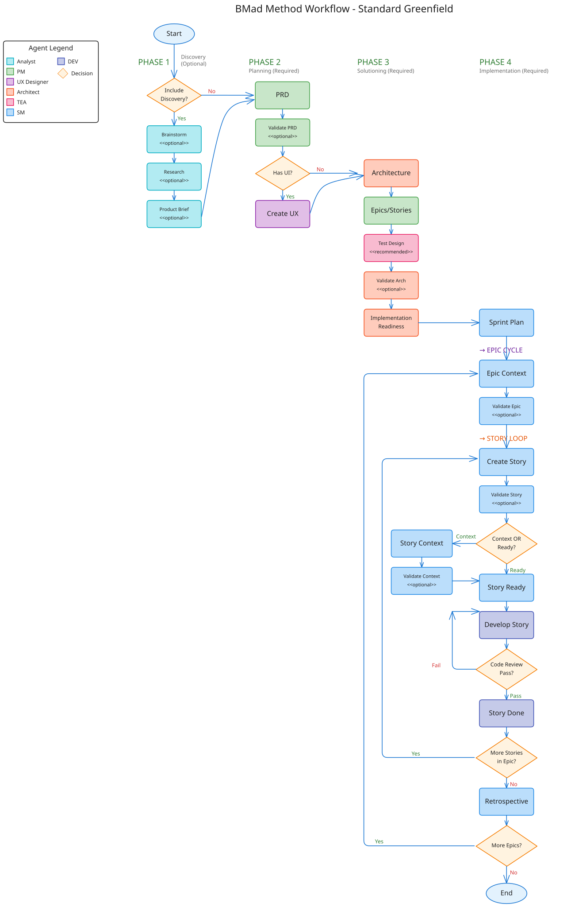

# Project Plan

## Instruksjoner

1. Der hvor det står {prompt / user-input-file}, kan dere legge inn en egen prompt eller filnavn for å gi ekstra instruksjoner. Hvis dere ikke ønsker å legge til ekstra instruksjoner, kan dere bare fjerne denne delen.
2. Hvis jeg har skrevet noe der allerede, f.eks. "Root Cause Analysis and Solution Design for Player Inactivity", så kan dere bytte ut min prompt med deres egen.

## Fase 1 Analysis

- [x] /run-agent-task analyst *workflow-init
  - [x] File: bmm-workflow-status.yaml
- [x] Brainstorming
  - [x] /run-agent-task analyst *brainstorm "Root Cause Analysis and Solution Design for Player Inactivity"
    - [x] File: brainstorming-session-results-date.md
  - [x] /run-agent-task analyst *brainstorm "User Flow Deviations & Edge Cases"
    - [x] File: brainstorming-session-results-date.md
  - [x] /run-agent-task analyst *brainstorm "Brainstorm what it means to have a paid user"
    - [x] File: brainstorming-session-results-date.md
- [x] Research
  - [x] /run-agent-task analyst *research "Which AI library should we use for orchestrating LLM interactions?"
    - [x] File: research-technical-date.md
- [x] Product Brief
  - [x] /run-agent-task analyst *product-brief "Read the two brainstorming sessions the research session and the @proposal.md file, and create a product brief for the project."
    - [x] File: product-brief.md

## Fase 2 Planning

- [x] Planning
  - [x] /run-agent-task pm *prd
    - [x] File: PRD.md
  - [x] /run-agent-task pm *validate-prd
    - [x] File: validation-report-date.md
  - [x] /run-agent-task ux-designer *create-ux-design {prompt / user-input-file}
    - [x] File: ux-design-specification.md
    - [x] File: ux-color-themes.html
    - [x] File: ux-design-directions.html
  - [x] /run-agent-task ux-designer *validate-ux-design {prompt / user-input-file}
  - [x] /run-agent-task tea *framework {prompt / user-input-file}
  - [x] /run-agent-task tea *ci {prompt / user-input-file}
  - [x] /run-agent-task tea *test-design {prompt / user-input-file}

## Fase 3 Solutioning

- [x] Solutioning
  - [x] /run-agent-task architect *create-architecture {prompt / user-input-file}
    - [x] File: architecture.md
  - [x] /run-agent-task pm *create-epics-and-stories {prompt / user-input-file}
    - [x] File: epics.md
  - [x] /run-agent-task architect *solutioning-gate-check {this command was not available, Gemini suggested *implementation-readiness instead as the closest option so we did that instead / user-input-file}
    - [x] File: implementation-readiness-report.md

## Fase 4 Implementation

- [ ] Implementation
  - [x] /run-agent-task sm *sprint-planning {prompt / user-input-file}
    - [x] File: sprint-artifacts/sprint-status.yaml
  - foreach epic in sprint planning:
    - [x] /run-agent-task sm create-epic-tech-context {prompt / user-input-file}
      - [x] File: sprint-artifacts/tech-spec-epic-{{epic_id}}.md
    - [x] /run-agent-task sm validate-epic-tech-context {prompt / user-input-file}
    - foreach story in epic:
      - [x] /run-agent-task sm *create-story {prompt / user-input-file}
        - [x] File: sprint-artifacts/{{story_key}}.md
      - [x] /run-agent-task sm *validate-create-story {prompt / user-input-file}
      - [x] /run-agent-task sm *create-story-context {prompt / user-input-file}
        - [x] File: sprint-artifacts/{{story_key}}.context.xml
      - [x] /run-agent-task sm *validate-story-context {prompt / user-input-file}
      - [ ] /run-agent-task dev *implement-story {prompt / user-input-file}
      - [ ] /run-agent-task dev *validate-story {prompt / user-input-file}
      - [ ] Manuell test i brukergrensesnittet, prompt: "I want to do a manual test of the features we just implemented in this story. Please guide me through how I can open the application in a browser without opening the interactive shell in this conversation, i.e. opening a different terminal and typing npm run dev. And then explain the steps to verify the features."
    - [ ] /run-agent-task sm *epic-retrospective {prompt / user-input-file}

## BMAD workflow

# Oversikt Epics fase 4
  - [x] Epic 1 (Sofie)
    - [x] /run-agent-task sm create-epic-tech-context {prompt / user-input-file}
      - [x] File: sprint-artifacts/tech-spec-epic-{{epic_id}}.md
    - [x] /run-agent-task sm validate-epic-tech-context {prompt / user-input-file}
    - foreach story in epic:
    - [x] 1.1 
      - [x] /run-agent-task sm *create-story {prompt / user-input-file}
        - [x] File: sprint-artifacts/{{story_key}}.md
      - [x] /run-agent-task sm *validate-create-story {prompt / user-input-file}
      - [x] /run-agent-task sm *create-story-context {prompt / user-input-file}
        - [x] File: sprint-artifacts/{{story_key}}.context.xml
      - [x] /run-agent-task sm *validate-story-context {prompt / user-input-file}
      - [x] /run-agent-task dev *implement-story {prompt / user-input-file}
      - [x] /run-agent-task dev *validate-story {prompt / user-input-file}
    - [x] 1.2
      - [x] /run-agent-task sm *create-story {prompt / user-input-file} - Hannah har gjort det
        - [x] File: sprint-artifacts/{{story_key}}.md
      - [x] /run-agent-task sm *validate-create-story {prompt / user-input-file}
      - [x] /run-agent-task sm *create-story-context {prompt / user-input-file}
        - [x] File: sprint-artifacts/{{story_key}}.context.xml
      - [x] /run-agent-task sm *validate-story-context {prompt / user-input-file}
      - [x] /run-agent-task dev *implement-story {prompt / user-input-file}
      - [x] /run-agent-task dev *validate-story {prompt / user-input-file}
    - [x] 1.3
      - [x] /run-agent-task sm *create-story {prompt / user-input-file}
        - [x] File: sprint-artifacts/{{story_key}}.md
      - [x] /run-agent-task sm *validate-create-story {prompt / user-input-file}
      - [x] /run-agent-task sm *create-story-context {prompt / user-input-file}
        - [x] File: sprint-artifacts/{{story_key}}.context.xml
      - [x] /run-agent-task sm *validate-story-context {prompt / user-input-file}
      - [x] /run-agent-task dev *implement-story {prompt / user-input-file}
      - [x] /run-agent-task dev *validate-story {prompt / user-input-file}
    - [x] 1.4
      - [x] /run-agent-task sm *create-story {prompt / user-input-file}
        - [x] File: sprint-artifacts/{{story_key}}.md
      - [x] /run-agent-task sm *validate-create-story {prompt / user-input-file}
      - [x] /run-agent-task sm *create-story-context {prompt / user-input-file}
        - [x] File: sprint-artifacts/{{story_key}}.context.xml
      - [x] /run-agent-task sm *validate-story-context {prompt / user-input-file}
      - [x] /run-agent-task dev *implement-story {prompt / user-input-file}
      - [x] /run-agent-task dev *validate-story {prompt / user-input-file}
    - [x] /run-agent-task sm *epic-retrospective {prompt / user-input-file}

- [x] Epic 2
    - [x] /run-agent-task sm create-epic-tech-context {prompt / user-input-file}
      - [x] File: sprint-artifacts/tech-spec-epic-{{epic_id}}.md
    - [x] /run-agent-task sm validate-epic-tech-context {prompt / user-input-file}
    - foreach story in epic:
      - [x] /run-agent-task sm *create-story {prompt / user-input-file}
        - [x] File: sprint-artifacts/{{story_key}}.md
      - [x] /run-agent-task sm *validate-create-story {prompt / user-input-file}
      - [x] /run-agent-task sm *create-story-context {prompt / user-input-file}
        - [x] File: sprint-artifacts/{{story_key}}.context.xml
      - [x] /run-agent-task sm *validate-story-context {prompt / user-input-file}
      - [x] /run-agent-task dev *develop-story {prompt / user-input-file}
      - [x] /run-agent-task dev *code-review {prompt / user-input-file}
      - [x] Manuell test i brukergrensesnittet, prompt: "I want to do a manual test of the features we just implemented in this story. Please guide me through how I can open the application in a browser without opening the interactive shell in this conversation, i.e. opening a different terminal and typing npm run dev. And then explain the steps to verify the features."
    - [x] /run-agent-task sm *epic-retrospective {prompt / user-input-file}

- [ ] Epic 3
    - [x] /run-agent-task sm create-epic-tech-context {prompt / user-input-file}
      - [x] File: sprint-artifacts/tech-spec-epic-{{epic_id}}.md
    - [x] /run-agent-task sm validate-epic-tech-context {prompt / user-input-file}
    - foreach story in epic:
      - [x] /run-agent-task sm *create-story {prompt / user-input-file}
        - [x] File: sprint-artifacts/{{story_key}}.md
      - [x] /run-agent-task sm *validate-create-story {prompt / user-input-file}
      - [x] /run-agent-task sm *create-story-context {prompt / user-input-file}
        - [x] File: sprint-artifacts/{{story_key}}.context.xml
      - [x] /run-agent-task sm *validate-story-context {prompt / user-input-file}
      - [x] /run-agent-task dev *develop-story {prompt / user-input-file}
      - [x] /run-agent-task dev *code-review {prompt / user-input-file}
      - [x] Manuell test i brukergrensesnittet, prompt: "I want to do a manual test of the features we just implemented in this story. Please guide me through how I can open the application in a browser without opening the interactive shell in this conversation, i.e. opening a different terminal and typing npm run dev. And then explain the steps to verify the features."
    - [ ] /run-agent-task sm *epic-retrospective {prompt / user-input-file}

- [ ] Epic 4 Sofie
    - [x] /run-agent-task sm create-epic-tech-context {prompt / user-input-file}
      - [x] File: sprint-artifacts/tech-spec-epic-{{epic_id}}.md
    - [x] /run-agent-task sm validate-epic-tech-context {prompt / user-input-file}
    - foreach story in epic:
    - [ ] 4.1
      - [x] /run-agent-task sm *create-story {prompt / user-input-file}
        - [x] File: sprint-artifacts/{{story_key}}.md
      - [x] /run-agent-task sm *validate-create-story {for story 4.1}
      - [x] /run-agent-task sm *create-story-context {for story 4.1}
        - [x] File: sprint-artifacts/{{story_key}}.context.xml
      - [x] /run-agent-task sm *validate-story-context {for story 4.1}
      - [x] /run-agent-task dev *develop-story {for story 4.1}
      - [ ] /run-agent-task dev *code-review {for story 4.1}
      - [ ] Manuell test i brukergrensesnittet, prompt: "I want to do a manual test of the features we just implemented in this story. Please guide me through how I can open the application in a browser without opening the interactive shell in this conversation, i.e. opening a diffe/run-agent-task sm *epic-retrospectiverent terminal and typing npm run dev. And then explain the steps to verify the features."
    - [ ] 4.2
      - [x] /run-agent-task sm *create-story {for story 4.2}
        - [x] File: sprint-artifacts/{{story_key}}.md
      - [x] /run-agent-task sm *validate-create-story {for story 4.2}
      - [x] /run-agent-task sm *create-story-context {for story 4.2}
        - [x] File: sprint-artifacts/{{story_key}}.context.xml
      - [x] /run-agent-task sm *validate-story-context {for story 4.2}
      - [ ] /run-agent-task dev *develop-story {for story 4.2}
      - [ ] /run-agent-task dev *code-review {for story 4.2}
      - [ ] Manuell test i brukergrensesnittet, prompt: "I want to do a manual test of the features we just implemented in this story. Please guide me through how I can open the application in a browser without opening the interactive shell in this conversation, i.e. opening a different terminal and typing npm run dev. And then explain the steps to verify the features."
    - [ ] 4.3
      - [x] /run-agent-task sm *create-story {for story 4.3}
        - [x] File: sprint-artifacts/{{story_key}}.md
      - [x] /run-agent-task sm *validate-create-story {for story 4.3}
      - [x] /run-agent-task sm *create-story-context {for story 4.3}
        - [x] File: sprint-artifacts/{{story_key}}.context.xml
      - [x] /run-agent-task sm *validate-story-context {for story 4.3}
      - [ ] /run-agent-task dev *develop-story {for story 4.3}
      - [ ] /run-agent-task dev *code-review {for story 4.3}
      - [ ] Manuell test i brukergrensesnittet, prompt: "I want to do a manual test of the features we just implemented in this story. Please guide me through how I can open the application in a browser without opening the interactive shell in this conversation, i.e. opening a different terminal and typing npm run dev. And then explain the steps to verify the features."
    - [ ] 4.4
      - [x] /run-agent-task sm *create-story {for story 4.4}
        - [x] File: sprint-artifacts/{{story_key}}.md
      - [x] /run-agent-task sm *validate-create-story {for story 4.4}
      - [x] /run-agent-task sm *create-story-context {for story 4.4}
        - [x] File: sprint-artifacts/{{story_key}}.context.xml
      - [x] /run-agent-task sm *validate-story-context {for story 4.4}
      - [ ] /run-agent-task dev *implement-story {for story 4.4}
      - [ ] /run-agent-task dev *validate-story {for story 4.4}
      - [ ] Manuell test i brukergrensesnittet, prompt: "I want to do a manual test of the features we just implemented in this story. Please guide me through how I can open the application in a browser without opening the interactive shell in this conversation, i.e. opening a different terminal and typing npm run dev. And then explain the steps to verify the features."
    - [ ] 4.5
      - [x] /run-agent-task sm *create-story {for story 4.5}
        - [x] File: sprint-artifacts/{{story_key}}.md
      - [x] /run-agent-task sm *validate-create-story {prompt / user-input-file}
      - [x] /run-agent-task sm *create-story-context {prompt / user-input-file}
        - [x] File: sprint-artifacts/{{story_key}}.context.xml
      - [x] /run-agent-task sm *validate-story-context {prompt / user-input-file}
      - [ ] /run-agent-task dev *implement-story {prompt / user-input-file}
      - [ ] /run-agent-task dev *validate-story {prompt / user-input-file}
      - [ ] Manuell test i brukergrensesnittet, prompt: "I want to do a manual test of the features we just implemented in this story. Please guide me through how I can open the application in a browser without opening the interactive shell in this conversation, i.e. opening a different terminal and typing npm run dev. And then explain the steps to verify the features."
    - [ ] 4.6
      - [x] /run-agent-task sm *create-story {prompt / user-input-file}
        - [x] File: sprint-artifacts/{{story_key}}.md
      - [x] /run-agent-task sm *validate-create-story {prompt / user-input-file}
      - [x] /run-agent-task sm *create-story-context {prompt / user-input-file}
        - [x] File: sprint-artifacts/{{story_key}}.context.xml
      - [x] /run-agent-task sm *validate-story-context {prompt / user-input-file}
      - [ ] /run-agent-task dev *develop-story {prompt / user-input-file}
      - [ ] /run-agent-task dev *code-review {prompt / user-input-file}
      - [ ] Manuell test i brukergrensesnittet, prompt: "I want to do a manual test of the features we just implemented in this story. Please guide me through how I can open the application in a browser without opening the interactive shell in this conversation, i.e. opening a different terminal and typing npm run dev. And then explain the steps to verify the features."
    - [ ] /run-agent-task sm *epic-retrospective {prompt / user-input-file}

- [ ] Epic 5
    - [x] /run-agent-task sm create-epic-tech-context {prompt / user-input-file}
      - [x] File: sprint-artifacts/tech-spec-epic-{{epic_id}}.md
    - [x] /run-agent-task sm validate-epic-tech-context {prompt / user-input-file}
    - foreach story in epic:
      - [x] /run-agent-task sm *create-story {prompt / user-input-file} 
        - [x] File: sprint-artifacts/{{story_key}}.md
      - [x] /run-agent-task sm *validate-create-story {prompt / user-input-file}
      - [x] /run-agent-task sm *create-story-context {prompt / user-input-file}
        - [x] File: sprint-artifacts/{{story_key}}.context.xml
      - [x] /run-agent-task sm *validate-story-context {prompt / user-input-file}
      - [ ] /run-agent-task dev *develop-story {prompt / user-input-file}
      - [ ] /run-agent-task dev *code-review {prompt / user-input-file}
      - [ ] Manuell test i brukergrensesnittet, prompt: "I want to do a manual test of the features we just implemented in this story. Please guide me through how I can open the application in a browser without opening the interactive shell in this conversation, i.e. opening a different terminal and typing npm run dev. And then explain the steps to verify the features."
    - [ ] /run-agent-task sm *epic-retrospective {prompt / user-input-file}