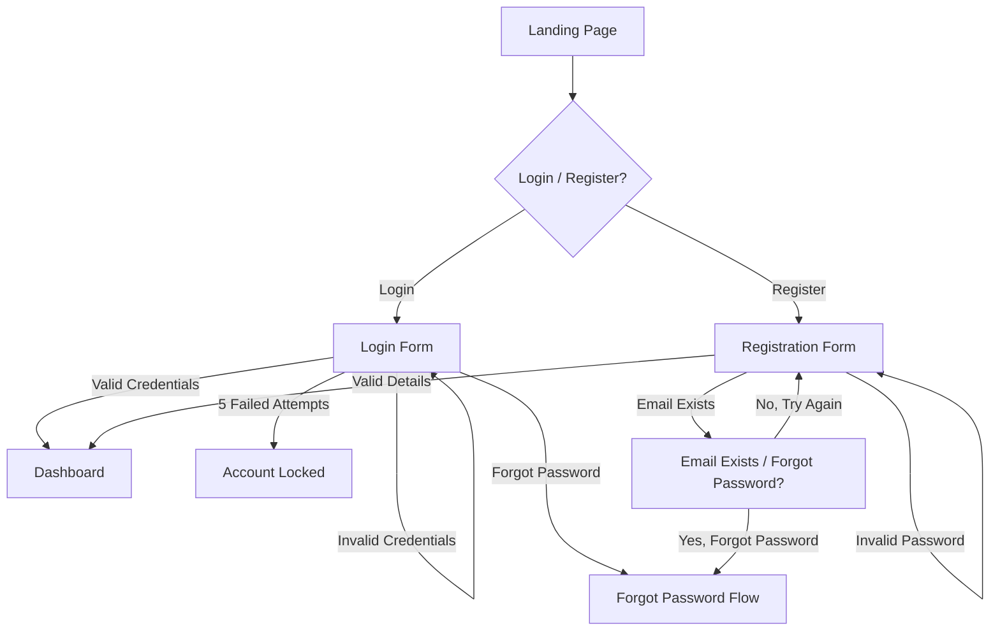
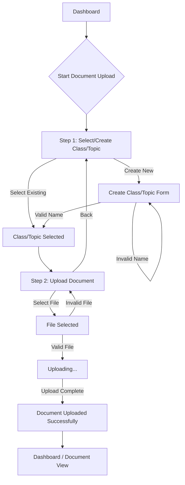

# ibe160 UX Design Specification

_Created on 2025-11-16 by BIP_
_Generated using BMad Method - Create UX Design Workflow v1.0_

---

## Executive Summary

The AI Study Buddy, a web app to help students overcome information overload by transforming dense study materials into concise summaries and interactive quizzes. The core goal is to shift users from feeling overwhelmed to feeling confident, making them feel empowered and in control, efficient and productive, focused, connected and engaged.

---

## 1. Design System Foundation

### 1.1 Design System Choice

We will be using **shadcn/ui** as our design system. This choice aligns perfectly with the project's use of React and Tailwind CSS, offering high customizability and full ownership of component code. This flexibility will allow us to craft a unique and tailored user experience that supports the project's vision and desired emotional responses. shadcn/ui provides a comprehensive set of accessible UI components, including Accordion, Alert Dialog, Button, Calendar, Card, Data Table, Dialog, Dropdown Menu, Form, Input, Select, Table, Tabs, and more.

---

## 2. Core User Experience

### 2.1 Defining Experience

The core experience revolves around users taking quizzes and reading summaries. Uploading files should be absolutely effortless. It is critical to get the generation of good summaries and quizzes right. The platform will be web-based. The defining experience is like having a personal learning-assistant.

### 2.2 Core Experience Principles

*   **Speed:** Key actions like generating summaries and quizzes should feel fast (under 30 seconds as per PRD), and UI interactions should be instantaneous.
*   **Guidance:** The experience should be supportive and provide clear, step-by-step guidance, especially for the target user "The Overwhelmed Student".
*   **Flexibility:** The user should have control over key aspects like quiz length, but the interface should remain simple and not overwhelming.
*   **Feedback:** Feedback should be motivational and celebratory to foster a sense of confidence and progress.

### 2.3 Novel UX Patterns

{{novel_ux_patterns}}

---

## 3. Visual Foundation

### 3.1 Color System

The chosen color theme is **"Calm & Focused (Revised)"**, which incorporates light blues (`#A7D9E8`), greens (`#C8E6C9`), pinks (`#F8BBD0`), and purples (`#E1BEE7`) to create a supportive, calm, and focused learning environment. Semantic colors for success (`#A5D6A7`), warning (`#FFCC80`), error (`#EF9A9A`), and info (`#90CAF9`) will be used, along with a neutral grayscale palette.

### 3.2 Typography

*   **Font Families:** Clean, modern sans-serif fonts (e.g., Inter, Roboto, or system fonts) for headings and body text, and a readable monospace font for technical elements.
*   **Type Scale:** A standard hierarchical scale (h1-h6, body, small, tiny) with clear visual distinction.
*   **Font Weights:** Regular, Medium, Semibold for emphasis.
*   **Line Heights:** Optimized for readability (e.g., 1.5 for body text).

### 3.3 Spacing and Layout

*   **Base Unit:** 4px, consistent with Tailwind CSS.
*   **Spacing Scale:** Tailwind's default spacing scale (e.g., `p-1` for 4px, `p-2` for 8px).
*   **Layout Grid:** A flexible 12-column grid system.
*   **Container Widths:** Responsive container widths for different breakpoints.

**Interactive Visualizations:**

- Color Theme Explorer: [ux-color-themes.html](./ux-color-themes.html)

---

## 4. Design Direction

### 4.1 Chosen Design Approach

The chosen design approach is a combination of "Minimalist & Focused" and "Guided Workflow & Progressive," which we can call **"Guided Minimalism"** or **"Focused Workflow."**

This approach will feature:
*   **Layout:** Primarily single-column for content, with clear, spacious steps for workflows.
*   **Visual Hierarchy:** Subtle headers, strong emphasis on the current step and content within that step.
*   **Interaction:** Guided, wizard-like flows for complex tasks (upload, generate), with direct and clear calls to action. Minimal distractions.
*   **Visual Weight:** Light, abundant white space to maintain focus and reduce overwhelm.
*   **Content Approach:** Focused on one task at a time within workflows, with highly scannable information.
*   **Personality:** Professional, Efficient, Supportive, and Easy.
*   **Best for:** Users who need clear guidance for tasks but also appreciate a clean, uncluttered interface that helps them stay focused, aligning with the goal of reducing cognitive load and fostering confidence.

**Interactive Mockups:**

- Design Direction Showcase: [ux-design-directions.html](./ux-design-directions.html)

---

## 5. User Journey Flows

### 5.1 Critical User Paths

#### User Journey: User Registration and Authentication

*   **User Goal:** Securely create an account, log in, and manage their profile.
*   **Approach:** Hybrid (Primary screen offers both "Login" and "Register" options. Clicking "Register" expands fields or transitions to a focused registration form, while "Login" remains concise.)

**Flow Steps:**

1.  **Landing Page / Entry:**
    *   User sees: Clear "Login" and "Register" calls to action.
    *   User does: Clicks "Login" or "Register".
    *   System responds: Displays login form or registration form.

2.  **Login Form:**
    *   User sees: Fields for Email and Password, "Forgot Password" link.
    *   User does: Enters credentials, clicks "Login".
    *   System responds:
        *   If successful: Redirects to Dashboard.
        *   If incorrect credentials: Displays error message.
        *   If 5 failed attempts: Account locked message.

3.  **Registration Form:**
    *   User sees: Fields for Email, Password, Confirm Password. Password strength requirements displayed (min 5 letters, 1 number, 1 special symbol).
    *   User does: Enters details, clicks "Register".
    *   System responds:
        *   If successful: Account created, user logged in or redirected to login.
        *   If email exists: "Email already in use, Forgot Password?" message.
        *   If password invalid: Real-time validation feedback.

**Decision Points:**
*   Email already exists during registration: Offer "Forgot Password".
*   Failed login attempts: Account lock after 5 attempts.

**Error States:**
*   Invalid email format.
*   Password not meeting requirements.
*   Passwords not matching.
*   Incorrect login credentials.
*   Account locked.

**Success State:**
*   User successfully logged in and redirected to the main application dashboard.

#### User Journey: Document Upload

*   **User Goal:** Upload study materials (text/PDF) to the application, organized within a class/topic.
*   **Approach:** Wizard/Stepper (Guided, multi-step process).

**Flow Steps:**

1.  **Step 1: Select or Create Class/Topic**
    *   User sees:
        *   A clear heading: "Step 1: Organize Your Document"
        *   A list of existing classes/topics with a "Select" button for each.
        *   A prominent "Create New Class/Topic" button.
        *   A "Next" button (disabled until a selection is made or new class created).
    *   User does:
        *   Selects an existing class/topic.
        *   OR Clicks "Create New Class/Topic".
    *   **Sub-flow: Create New Class/Topic**
        *   User sees: A modal or inline form with a field for "Class/Topic Name" and "Create" / "Cancel" buttons.
        *   User does: Enters a name, clicks "Create".
        *   System responds:
            *   If successful: New class/topic added to the list, automatically selected.
            *   If name invalid/duplicate: Error message.
    *   User does: Clicks "Next".

2.  **Step 2: Upload Document**
    *   User sees:
        *   A clear heading: "Step 2: Upload Your File"
        *   The selected class/topic name displayed.
        *   A drag-and-drop area or "Browse Files" button.
        *   Information about supported file types (.txt, .pdf) and max file size (10MB).
        *   A "Back" button to return to Step 1.
        *   A "Upload" button (disabled until a file is selected).
    *   User does: Selects a file.
    *   System responds:
        *   Visual indication of file upload progress (e.g., progress bar).
        *   If file type unsupported: Error message: "This file type is not supported. Please try another file."
        *   If file too large: Error message: "File size exceeds 10MB limit."
        *   If PDF password-protected/corrupted: Error message: "This file is password-protected or corrupted and cannot be processed."
    *   User does: Clicks "Upload".

**Success State:**
*   Confirmation message: "Document uploaded successfully to [Class/Topic Name]!"
*   User is redirected to the dashboard or the newly uploaded document's view.

---

## 6. Component Library

### 6.1 Component Strategy

{{component_library_strategy}}

---

## 7. UX Pattern Decisions

### 7.1 Consistency Rules

{{ux_pattern_decisions}}

---

## 8. Responsive Design & Accessibility

### 8.1 Responsive Strategy

{{responsive_accessibility_strategy}}

---

## 9. Implementation Guidance

### 9.1 Completion Summary

{{completion_summary}}

---

## Appendix

### Related Documents

- Product Requirements: `{{prd_file}}`
- Product Brief: `{{brief_file}}`
- Brainstorming: `{{brainstorm_file}}`

### Core Interactive Deliverables

This UX Design Specification was created through visual collaboration:

- **Color Theme Visualizer**: {{color_themes_html}}
  - Interactive HTML showing all color theme options explored
  - Live UI component examples in each theme
  - Side-by-side comparison and semantic color usage

- **Design Direction Mockups**: {{design_directions_html}}
  - Interactive HTML with 6-8 complete design approaches
  - Full-screen mockups of key screens
  - Design philosophy and rationale for each direction

### Optional Enhancement Deliverables

_This section will be populated if additional UX artifacts are generated through follow-up workflows._

<!-- Additional deliverables added here by other workflows -->

### Next Steps & Follow-Up Workflows

This UX Design Specification can serve as input to:

- **Wireframe Generation Workflow** - Create detailed wireframes from user flows
- **Figma Design Workflow** - Generate Figma files via MCP integration
- **Interactive Prototype Workflow** - Build clickable HTML prototypes
- **Component Showcase Workflow** - Create interactive component library
- **AI Frontend Prompt Workflow** - Generate prompts for v0, Lovable, Bolt, etc.
- **Solution Architecture Workflow** - Define technical architecture with UX context

### Version History

| Date     | Version | Changes                         | Author        |
| -------- | ------- | ------------------------------- | ------------- |
| 2025-11-16 | 1.0     | Initial UX Design Specification | BIP |

---

_This UX Design Specification was created through collaborative design facilitation, not template generation. All decisions were made with user input and are documented with rationale._
