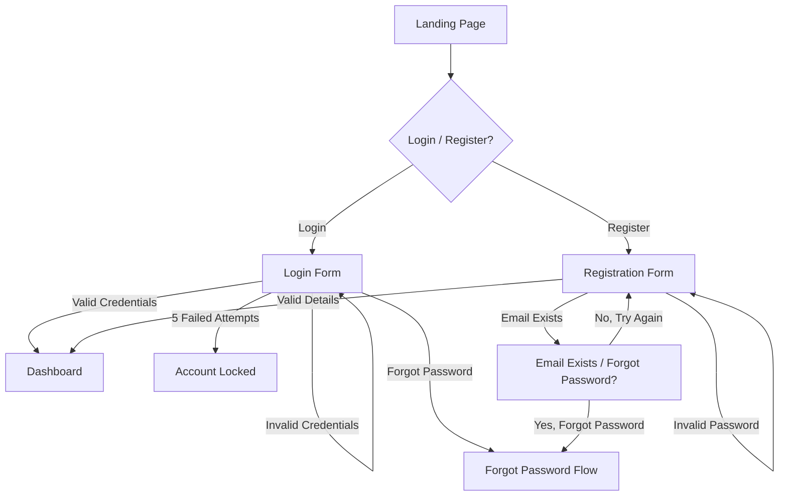
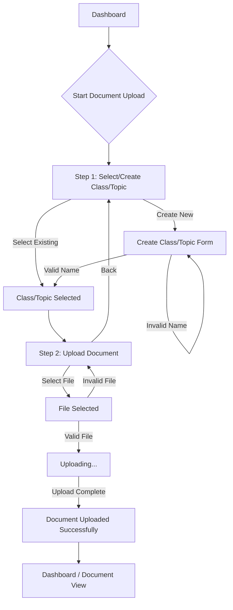

# ibe160 UX Design Specification

_Created on 2025-11-16 by BIP_
_Generated using BMad Method - Create UX Design Workflow v1.0_

---

## Executive Summary

The AI Study Buddy, a web app to help students overcome information overload by transforming dense study materials into concise summaries and interactive quizzes. The core goal is to shift users from feeling overwhelmed to feeling confident, making them feel empowered and in control, efficient and productive, focused, connected and engaged.

---

## 1. Design System Foundation

### 1.1 Design System Choice

We will be using **shadcn/ui** as our design system. This choice aligns perfectly with the project's use of React and Tailwind CSS, offering high customizability and full ownership of component code. This flexibility will allow us to craft a unique and tailored user experience that supports the project's vision and desired emotional responses. shadcn/ui provides a comprehensive set of accessible UI components, including Accordion, Alert Dialog, Button, Calendar, Card, Data Table, Dialog, Dropdown Menu, Form, Input, Select, Table, Tabs, and more.

---

## 2. Core User Experience

### 2.1 Defining Experience

The core experience revolves around users taking quizzes and reading summaries. Uploading files should be absolutely effortless. It is critical to get the generation of good summaries and quizzes right. The platform will be web-based. The defining experience is like having a personal learning-assistant.

### 2.2 Core Experience Principles

*   **Speed:** Key actions like generating summaries and quizzes should feel fast (under 30 seconds as per PRD), and UI interactions should be instantaneous.
*   **Guidance:** The experience should be supportive and provide clear, step-by-step guidance, especially for the target user "The Overwhelmed Student".
*   **Flexibility:** The user should have control over key aspects like quiz length, but the interface should remain simple and not overwhelming.
*   **Feedback:** Feedback should be motivational and celebratory to foster a sense of confidence and progress.

### 2.3 Novel UX Patterns

{{novel_ux_patterns}}

---

## 3. Visual Foundation

### 3.1 Color System

The chosen color theme is **"Calm & Focused (Revised)"**, which incorporates light blues (`#A7D9E8`), greens (`#C8E6C9`), pinks (`#F8BBD0`), and purples (`#E1BEE7`) to create a supportive, calm, and focused learning environment. Semantic colors for success (`#A5D6A7`), warning (`#FFCC80`), error (`#EF9A9A`), and info (`#90CAF9`) will be used, along with a neutral grayscale palette.

### 3.2 Typography

*   **Font Families:** Clean, modern sans-serif fonts (e.g., Inter, Roboto, or system fonts) for headings and body text, and a readable monospace font for technical elements.
*   **Type Scale:** A standard hierarchical scale (h1-h6, body, small, tiny) with clear visual distinction.
*   **Font Weights:** Regular, Medium, Semibold for emphasis.
*   **Line Heights:** Optimized for readability (e.g., 1.5 for body text).

### 3.3 Spacing and Layout

*   **Base Unit:** 4px, consistent with Tailwind CSS.
*   **Spacing Scale:** Tailwind's default spacing scale (e.g., `p-1` for 4px, `p-2` for 8px).
*   **Layout Grid:** A flexible 12-column grid system.
*   **Container Widths:** Responsive container widths for different breakpoints.

**Interactive Visualizations:**

- Color Theme Explorer: [ux-color-themes.html](./ux-color-themes.html)

---

## 4. Design Direction

### 4.1 Chosen Design Approach

The chosen design approach is a combination of "Minimalist & Focused" and "Guided Workflow & Progressive," which we can call **"Guided Minimalism"** or **"Focused Workflow."**

This approach will feature:
*   **Layout:** Primarily single-column for content, with clear, spacious steps for workflows.
*   **Visual Hierarchy:** Subtle headers, strong emphasis on the current step and content within that step.
*   **Interaction:** Guided, wizard-like flows for complex tasks (upload, generate), with direct and clear calls to action. Minimal distractions.
*   **Visual Weight:** Light, abundant white space to maintain focus and reduce overwhelm.
*   **Content Approach:** Focused on one task at a time within workflows, with highly scannable information.
*   **Personality:** Professional, Efficient, Supportive, and Easy.
*   **Best for:** Users who need clear guidance for tasks but also appreciate a clean, uncluttered interface that helps them stay focused, aligning with the goal of reducing cognitive load and fostering confidence.

**Interactive Mockups:**

- Design Direction Showcase: [ux-design-directions.html](./ux-design-directions.html)

---

## 5. User Journey Flows

### 5.1 Critical User Paths

#### User Journey: User Registration and Authentication

*   **User Goal:** Securely create an account, log in, and manage their profile.
*   **Approach:** Hybrid (Primary screen offers both "Login" and "Register" options. Clicking "Register" expands fields or transitions to a focused registration form, while "Login" remains concise.)

**Flow Steps:**

1.  **Landing Page / Entry:**
    *   User sees: Clear "Login" and "Register" calls to action.
    *   User does: Clicks "Login" or "Register".
    *   System responds: Displays login form or registration form.

2.  **Login Form:**
    *   User sees: Fields for Email and Password, "Forgot Password" link.
    *   User does: Enters credentials, clicks "Login".
    *   System responds:
        *   If successful: Redirects to Dashboard.
        *   If incorrect credentials: Displays error message.
        *   If 5 failed attempts: Account locked message.

3.  **Registration Form:**
    *   User sees: Fields for Email, Password, Confirm Password. Password strength requirements displayed (min 5 letters, 1 number, 1 special symbol).
    *   User does: Enters details, clicks "Register".
    *   System responds:
        *   If successful: Account created, user logged in or redirected to login.
        *   If email exists: "Email already in use, Forgot Password?" message.
        *   If password invalid: Real-time validation feedback.

**Decision Points:**
*   Email already exists during registration: Offer "Forgot Password".
*   Failed login attempts: Account lock after 5 attempts.

**Error States:**
*   Invalid email format.
*   Password not meeting requirements.
*   Passwords not matching.
*   Incorrect login credentials.
*   Account locked.

**Success State:**
*   User successfully logged in and redirected to the main application dashboard.



#### User Journey: Document Upload

*   **User Goal:** Upload study materials (text/PDF) to the application, organized within a class/topic.
*   **Approach:** Wizard/Stepper (Guided, multi-step process).

**Flow Steps:**

1.  **Step 1: Select or Create Class/Topic**
    *   User sees:
        *   A clear heading: "Step 1: Organize Your Document"
        *   A list of existing classes/topics with a "Select" button for each.
        *   A prominent "Create New Class/Topic" button.
        *   A "Next" button (disabled until a selection is made or new class created).
    *   User does:
        *   Selects an existing class/topic.
        *   OR Clicks "Create New Class/Topic".
    *   **Sub-flow: Create New Class/Topic**
        *   User sees: A modal or inline form with a field for "Class/Topic Name" and "Create" / "Cancel" buttons.
        *   User does: Enters a name, clicks "Create".
        *   System responds:
            *   If successful: New class/topic added to the list, automatically selected.
            *   If name invalid/duplicate: Error message.
    *   User does: Clicks "Next".

2.  **Step 2: Upload Document**
    *   User sees:
        *   A clear heading: "Step 2: Upload Your File"
        *   The selected class/topic name displayed.
        *   A drag-and-drop area or "Browse Files" button.
        *   Information about supported file types (.txt, .pdf) and max file size (10MB).
        *   A "Back" button to return to Step 1.
        *   A "Upload" button (disabled until a file is selected).
    *   User does: Selects a file.
    *   System responds:
        *   Visual indication of file upload progress (e.g., progress bar).
        *   If file type unsupported: Error message: "This file type is not supported. Please try another file."
        *   If file too large: Error message: "File size exceeds 10MB limit."
        *   If PDF password-protected/corrupted: Error message: "This file is password-protected or corrupted and cannot be processed."
    *   User does: Clicks "Upload".

**Success State:**
*   Confirmation message: "Document uploaded successfully to [Class/Topic Name]!"
*   User is redirected to the dashboard or the newly uploaded document's view.



#### User Journey: Quiz Generation

*   **User Goal:** Generate a customized quiz from one or more documents.
*   **Approach:** Wizard/Stepper (A guided, multi-step process to configure and generate the quiz).

**Flow Steps:**

1.  **Entry Point (Context-Aware)**
    *   **Scenario A (From Document View):**
        *   User sees: A "Generate Quiz" button on the document page.
        *   User does: Clicks "Generate Quiz".
        *   System responds: Opens the Quiz Generation wizard, pre-selecting the current document.
    *   **Scenario B (From Dashboard/Elsewhere):**
        *   User sees: A "Generate Quiz" button.
        *   User does: Clicks "Generate Quiz".
        *   System responds: Opens the Quiz Generation wizard at Step 1.

2.  **Step 1: Select Document(s) (Conditional)**
    *   *This step is skipped if the user started from a document view.*
    *   User sees: A list of their uploaded documents, grouped by class/topic, with checkboxes.
    *   User does: Selects one or more documents.
    *   System responds: Enables the "Next" button.

3.  **Step 2: Configure Quiz Options**
    *   User sees:
        *   A clear heading: "Customize Your Quiz".
        *   **Quiz Length Options:** "Short (5 questions)", "Medium (10 questions)", "Long (15+ questions)".
        *   **Question Type Options:** "Multiple Choice", "True/False", "Combination".
        *   A **Summary Box** that updates in real-time (e.g., "You are creating a **Medium** quiz with **Combination** questions from **[Document Name]**.").
        *   "Back" and "Generate Quiz" buttons.
    *   User does: Selects their desired options.
    *   System responds: Updates the summary box.

4.  **Step 3: Generation in Progress**
    *   *This happens after the user clicks "Generate Quiz".*
    *   User sees: A loading screen or modal with a message like: "Generating your quiz... This may take up to 30 seconds." and a progress indicator.
    *   System responds: Processes the document(s) and generates the quiz questions in the background.
    *   **Error State:** If generation fails (e.g., document is unreadable, server error), a message appears: "Sorry, we couldn't generate your quiz. Please try again."

5.  **Step 4: Success & Start**
    *   User sees: A confirmation pop-up: "Your quiz is ready!" with a prominent "Start Quiz" button and maybe a "Save for Later" option.
    *   User does: Clicks "Start Quiz".
    *   System responds: Navigates the user to the first question of the quiz.

**Success State:**
*   The user is seamlessly transitioned into the quiz-taking experience.

```mermaid
graph TD
    subgraph Entry Point
        A[Document View] -->|Click "Generate Quiz"| C;
        B[Dashboard] -->|Click "Generate Quiz"| D[Step 1: Select Document(s)];
    end

    subgraph Quiz Wizard
        D --> C[Step 2: Configure Quiz];
        C --> E{Click "Generate Quiz"};
        E --> F[Step 3: Generation in Progress...];
        F -- Success --> G[Step 4: Success Modal];
        F -- Failure --> H[Error Message];
    end

    subgraph Taking the Quiz
        G -- Click "Start Quiz" --> I[Quiz Interface];
    end

    H --> C;
```

#### User Journey: Summary Generation

*   **User Goal:** Generate a concise summary from one or more documents in a preferred format.
*   **Approach:** Wizard/Stepper (A guided, multi-step process to configure and generate the summary).

**Flow Steps:**

1.  **Entry Point (Context-Aware)**
    *   **Scenario A (From Document View):**
        *   User sees: A "Generate Summary" button on the document page, next to or near the "Generate Quiz" button.
        *   User does: Clicks "Generate Summary".
        *   System responds: Opens the Summary Generation wizard, pre-selecting the current document.
    *   **Scenario B (From Dashboard/Elsewhere):**
        *   User sees: A "Generate Summary" button.
        *   User does: Clicks "Generate Summary".
        *   System responds: Opens the Summary Generation wizard at Step 1.

2.  **Step 1: Select Document(s) (Conditional)**
    *   *This step is skipped if the user started from a document view.*
    *   User sees: A list of their uploaded documents, grouped by class/topic, with checkboxes.
    *   User does: Selects one or more documents.
    *   System responds: Enables the "Next" button.

3.  **Step 2: Configure Summary Options**
    *   User sees:
        *   A clear heading: "Customize Your Summary".
        *   **Summary Format Options:** "Paragraph Summary", "Bullet Point Summary".
        *   A **Summary Box** that updates in real-time (e.g., "You are creating a **Bullet Point Summary** from **[Document Name]**.").
        *   "Back" and "Generate Summary" buttons.
    *   User does: Selects their desired format.
    *   System responds: Updates the summary box.

4.  **Step 3: Generation in Progress**
    *   *This happens after the user clicks "Generate Summary".*
    *   User sees: A loading screen or modal with a message like: "Generating your summary... This may take up to 30 seconds." and a progress indicator.
    *   System responds: Processes the document(s) and generates the summary in the background.
    *   **Error State:** If generation fails (e.g., document is unreadable, server error), a message appears: "Sorry, we couldn't generate your summary. Please try again."

5.  **Step 4: Success & View**
    *   User sees: A confirmation pop-up: "Your summary is ready!" with a prominent "View Summary" button and maybe a "Save for Later" option.
    *   User does: Clicks "View Summary".
    *   System responds: Navigates the user to the generated summary view.

**Success State:**
*   The user is seamlessly transitioned to view their generated summary.

```mermaid
graph TD
    subgraph Entry Point
        A[Document View] -->|Click "Generate Summary"| C;
        B[Dashboard] -->|Click "Generate Summary"| D[Step 1: Select Document(s)];
    end

    subgraph Summary Wizard
        D --> C[Step 2: Configure Summary];
        C --> E{Click "Generate Summary"};
        E --> F[Step 3: Generation in Progress...];
        F -- Success --> G[Step 4: Success Modal];
        F -- Failure --> H[Error Message];
    end

    subgraph Viewing the Summary
        G -- Click "View Summary" --> I[Summary View];
    end

    H --> C;
```

---

## 6. Component Library

### 6.1 Component Strategy

### 6.1 Component Strategy

Our strategy is to leverage **shadcn/ui** for as many standard components as possible, customizing them to fit our "Calm & Focused" color theme and "Guided Minimalism" design direction. We will identify and design custom components only when shadcn/ui does not offer a suitable primitive or when a unique interaction is required.

**Required Components Identified from User Journeys:**

*   **Input Fields:** Email, Password, Text (for class/topic names).
*   **Buttons:** Primary actions (e.g., "Generate Quiz", "Upload"), Secondary actions (e.g., "Back", "Cancel"), Destructive actions (if any).
*   **Links:** "Forgot Password".
*   **Modals/Dialogs:** For confirmations, errors, or multi-step forms (like "Create New Class/Topic").
*   **Lists/Tables:** To display existing classes/topics and documents.
*   **Checkboxes:** For selecting multiple documents.
*   **Radio Buttons/Segmented Controls:** For quiz length and question type, summary format.
*   **Progress Indicators:** For file uploads and content generation (loading screens, progress bars).
*   **Alerts/Toasts:** For success, error, warning, and info messages.
*   **Cards:** To display individual documents or quiz/summary options.
*   **Forms:** To group input fields and controls.
*   **Navigation:** Potentially tabs or a sidebar for main application navigation.
*   **Empty States:** For when no documents or quizzes exist.

**Components Provided by shadcn/ui:**

Many of the identified components are directly available or can be easily built using shadcn/ui primitives:

*   **Input:** For all text and password fields.
*   **Button:** For all action buttons.
*   **Dialog / AlertDialog:** Perfect for modals, confirmations, and error messages.
*   **Table:** Can be used for displaying lists of documents or classes.
*   **Checkbox:** For document selection.
*   **RadioGroup:** For quiz length, question type, and summary format.
*   **Progress:** For upload and generation progress.
*   **Toast / Alert:** For various feedback messages.
*   **Card:** Excellent for displaying documents, quizzes, or summaries in a visually distinct manner.
*   **Form:** To manage form states and validation.
*   **Tabs:** If we opt for tab-based navigation.

**Custom Components Needed / Components Requiring Heavy Customization:**

Given shadcn/ui's flexibility, truly custom components might be minimal, but some will require specific styling or composition:

*   **Document Preview Component:** A small, interactive view of an uploaded document (e.g., a thumbnail for PDFs, or a snippet for text files) with actions like "Generate Quiz" or "Generate Summary". While we can compose this from `Card` and `Button` components, the specific layout and interaction for the preview itself will be custom.
*   **Drag-and-Drop Upload Area:** While shadcn/ui provides `Input` components, a dedicated drag-and-drop zone with visual feedback (e.g., hover states, file count) will likely be a custom composition.
*   **Loading Screen/Modal for Generation:** While `Dialog` and `Progress` can be used, the full-screen overlay with specific messaging and animation during the 30-second generation time will be a custom implementation.
*   **Quiz Interface:** The interactive quiz-taking interface itself (displaying questions, options, tracking progress, submitting answers) will be a highly custom component, composed of various shadcn/ui elements but with unique logic and layout.
*   **Summary View:** The dedicated view for displaying generated summaries, potentially with options for copying or exporting, will also be a custom layout.

This strategy allows us to move quickly with established patterns while focusing our custom development efforts on the unique, core experiences of the AI Study Buddy.

---

## 7. UX Pattern Decisions

### 7.1 Consistency Rules

To ensure a predictable and intuitive user experience, the following UI patterns will be standardized across the application.

#### 1. Button Hierarchy and Usage

*   **Primary Buttons:**
    *   **Use Case:** For the single most important action on a page or in a flow (e.g., "Generate Quiz", "Upload Document").
    *   **Styling:** Solid background color, high contrast.
    *   **Rule:** Only one primary button should be visible in a given view or container.
*   **Secondary Buttons:**
    *   **Use Case:** For alternative, less critical actions (e.g., "Back", "Cancel", "Save for Later").
    *   **Styling:** Outlined or subtle background color.
*   **Tertiary/Link Buttons:**
    *   **Use Case:** For non-essential actions or navigation links within content (e.g., "Learn More", "Forgot Password").
    *   **Styling:** Text-only with an underline on hover.
*   **Disabled State:**
    *   **Rule:** All buttons must have a clear disabled state (e.g., reduced opacity, non-interactive) when their action is unavailable.

#### 2. Feedback Messages (Alerts & Toasts)

*   **Success Messages:**
    *   **Use Case:** Confirming a user's action was completed successfully (e.g., "Document uploaded successfully!").
    *   **Implementation:** Use a non-intrusive toast notification that disappears automatically after a few seconds.
*   **Error Messages:**
    *   **Use Case:** Informing the user that an action failed or an input is invalid.
    *   **Implementation:**
        *   For form validation: Displayed inline, next to the relevant field.
        *   For system errors: Use a persistent Alert component or a modal dialog for critical failures.
*   **Informational Messages:**
    *   **Use Case:** Providing helpful context or guidance (e.g., "Generating your quiz... This may take up to 30 seconds.").
    *   **Implementation:** Use a dismissible Alert component.
*   **Warning Messages:**
    *   **Use Case:** Alerting the user to a potentially unintended consequence (e.g., "Are you sure you want to delete this document?").
    *   **Implementation:** Use a modal dialog requiring confirmation.

#### 3. Form Behaviors

*   **Labels:** All input fields must have clear, visible labels.
*   **Required Fields:** Clearly mark required fields with an asterisk (*).
*   **Validation:** Provide real-time, inline validation feedback as the user types where possible (e.g., for password strength).
*   **Submission:** The primary submission button should be disabled until all required fields are validly filled.

#### 4. Modals and Dialogs

*   **Use Case:** For critical information, confirmation prompts, or short, focused tasks (like "Create New Class/Topic") that interrupt the main user flow.
*   **Behavior:**
    *   Should always be dismissible via an "X" icon, the Escape key, or clicking the overlay.
    *   Should trap focus, meaning users cannot interact with the content behind the modal.
*   **Distinction:**
    *   **Modal:** For user-initiated tasks.
    *   **Dialog/Alert:** For system-initiated messages (errors, warnings, confirmations).

#### 5. Navigation

*   **Primary Navigation:** A persistent sidebar or header will provide access to the main sections of the application (e.g., Dashboard, Documents, Settings).
*   **Breadcrumbs:** For nested views (e.g., within a specific class/topic), breadcrumbs will be used to show the user's current location and allow for easy navigation back to parent levels.
*   **Wizard/Stepper Navigation:** In multi-step flows, "Back" and "Next" buttons will be used for linear navigation. A visual indicator will show the user's progress through the steps.

---

## 8. Responsive Design & Accessibility

### 8.1 Responsive Strategy

Our responsive design strategy will prioritize a mobile-first approach, ensuring core functionality and optimal user experience on smaller screens before scaling up to tablets and desktops. We will leverage Tailwind CSS's utility-first framework for efficient breakpoint management.

*   **Breakpoints:** We will utilize Tailwind CSS's default breakpoints (sm, md, lg, xl, 2xl) to define responsive behaviors.
*   **Layout Adaptation:**
    *   **Mobile (Small Screens):** Single-column layouts, stacked elements, and touch-friendly controls. Navigation will likely be a hamburger menu or bottom navigation bar.
    *   **Tablet (Medium Screens):** Two-column layouts where appropriate, expanded navigation, and optimized spacing.
    *   **Desktop (Large Screens):** Multi-column layouts, persistent sidebars for navigation, and rich interactive elements.
*   **Content Prioritization:** On smaller screens, non-essential information will be progressively disclosed or hidden to maintain focus on critical tasks.
*   **Fluid Typography & Spacing:** Font sizes and spacing will adjust proportionally across breakpoints to maintain readability and visual balance.

### 8.2 Accessibility Strategy

Accessibility is a core principle of the AI Study Buddy, ensuring that all users, regardless of ability, can effectively use the application. We will adhere to WCAG 2.1 AA standards.

*   **Semantic HTML:** Use appropriate HTML5 semantic elements to provide meaningful structure for assistive technologies.
*   **Keyboard Navigation:** All interactive elements will be fully navigable and operable via keyboard, with clear focus indicators.
*   **ARIA Attributes:** Employ ARIA (Accessible Rich Internet Applications) attributes where standard HTML elements do not convey sufficient semantic meaning (e.g., for custom components).
*   **Color Contrast:** Ensure sufficient color contrast ratios for all text and interactive elements to meet WCAG AA guidelines.
*   **Alternative Text:** Provide descriptive `alt` text for all meaningful images and non-text content.
*   **Form Accessibility:** Implement accessible form labels, error messages, and input validation.
*   **Focus Management:** Carefully manage focus for dynamic content, modals, and interactive components.
*   **Testing:** Conduct regular accessibility audits using automated tools (e.g., Lighthouse, axe-core) and manual testing with screen readers (e.g., VoiceOver, NVDA) to identify and rectify issues.

---

## 9. Implementation Guidance

### 9.1 Completion Summary

This UX Design Specification comprehensively outlines the user experience for the AI Study Buddy application. Through a structured design thinking process, we have established a robust foundation for development, covering:

*   **Design System Foundation:** Selection of shadcn/ui for its flexibility and alignment with React/Tailwind CSS.
*   **Core User Experience:** Defined the central user interactions, emphasizing speed, guidance, flexibility, and motivational feedback.
*   **Visual Foundation:** Established a "Calm & Focused" color theme, clear typography, and a consistent spacing/layout system.
*   **Design Direction:** Adopted a "Guided Minimalism" approach, focusing on clarity, efficiency, and user support.
*   **User Journey Flows:** Detailed critical user paths for Registration, Document Upload, Quiz Generation, and Summary Generation, including decision points and error states.
*   **Component Library Strategy:** Identified required components and outlined how shadcn/ui will be leveraged, along with areas requiring custom development.
*   **UX Pattern Decisions:** Standardized rules for button hierarchy, feedback messages, form behaviors, modals, and navigation to ensure consistency.
*   **Responsive Design & Accessibility:** Defined a mobile-first responsive strategy and committed to WCAG 2.1 AA compliance, including semantic HTML, keyboard navigation, ARIA attributes, and color contrast.

This document serves as a definitive guide for the development team, ensuring a shared understanding of the user experience vision and providing actionable insights for implementation. The interactive deliverables (Color Theme Visualizer, Design Direction Mockups) further enrich this specification by providing tangible visual references. The AI Study Buddy is now well-positioned to move into detailed wireframing, prototyping, and frontend development, with a clear focus on delivering an intuitive, efficient, and accessible learning tool for students.

---

## Appendix

### Related Documents

- Product Requirements: `{{prd_file}}`
- Product Brief: `{{brief_file}}`
- Brainstorming: `{{brainstorm_file}}`

### Core Interactive Deliverables

This UX Design Specification was created through visual collaboration:

- **Color Theme Visualizer**: {{color_themes_html}}
  - Interactive HTML showing all color theme options explored
  - Live UI component examples in each theme
  - Side-by-side comparison and semantic color usage

- **Design Direction Mockups**: {{design_directions_html}}
  - Interactive HTML with 6-8 complete design approaches
  - Full-screen mockups of key screens
  - Design philosophy and rationale for each direction

### Optional Enhancement Deliverables

_This section will be populated if additional UX artifacts are generated through follow-up workflows._

<!-- Additional deliverables added here by other workflows -->

### Next Steps & Follow-Up Workflows

This UX Design Specification can serve as input to:

- **Wireframe Generation Workflow** - Create detailed wireframes from user flows
- **Figma Design Workflow** - Generate Figma files via MCP integration
- **Interactive Prototype Workflow** - Build clickable HTML prototypes
- **Component Showcase Workflow** - Create interactive component library
- **AI Frontend Prompt Workflow** - Generate prompts for v0, Lovable, Bolt, etc.
- **Solution Architecture Workflow** - Define technical architecture with UX context

### Version History

| Date     | Version | Changes                         | Author        |
| -------- | ------- | ------------------------------- | ------------- |
| 2025-11-16 | 1.0     | Initial UX Design Specification | BIP |

---

_This UX Design Specification was created through collaborative design facilitation, not template generation. All decisions were made with user input and are documented with rationale._
